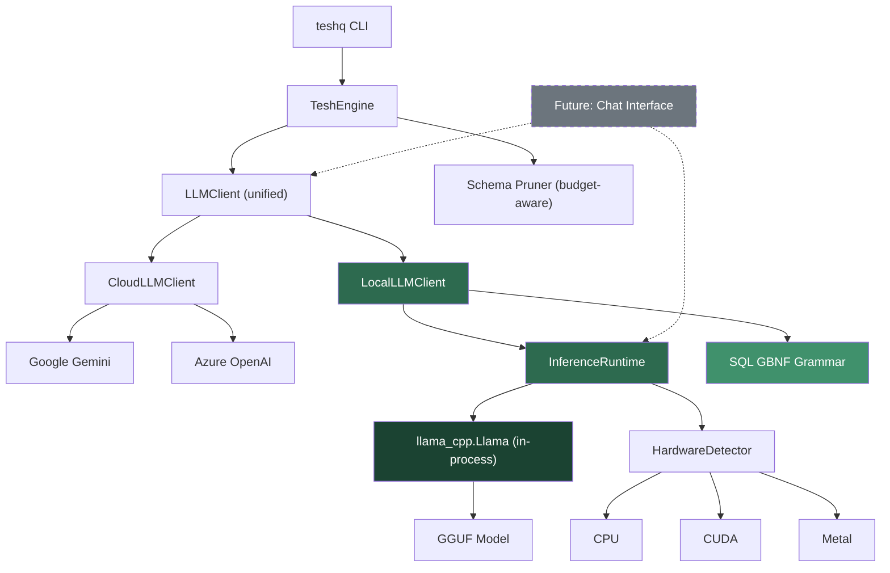
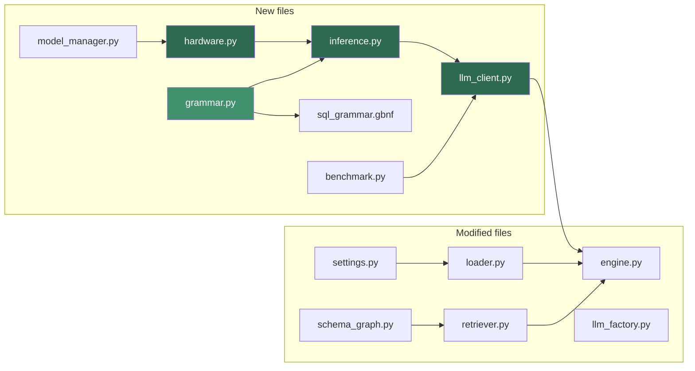

# TESHQ v3 Architecture & Implementation Plans

## Status Overview

- **Local LLM Backend (In-Process Inference):** DONE (Shipped in v3.0.0.dev1)
- **Dialect Skills System (Modular Database Support):** PENDING (Targeting v3.0.0 Stable)

---

# 1. Local LLM Backend (DONE)

# Local LLM Backend for TESH Query — Implementation Plan (v2)

Add a **direct, in-process** local inference backend to TESH Query using `llama-cpp-python` (Python bindings for llama.cpp). No HTTP server, no Docker, no separate process — the GGUF model loads directly into the TESH Query Python process.

## Architecture Overview



### Why In-Process, Not llama-server

| | In-process (`llama-cpp-python`) | Separate server (`llama-server`) |
|---|---|---|
| **Latency** | Zero HTTP overhead, direct C function calls | 5-20ms per request (localhost HTTP) |
| **Complexity** | Single process, `pip install` | Spawn/manage child process, health checks, port conflicts |
| **Memory** | Shared address space, no duplication | Separate process memory |
| **User DX** | `pip install teshq[local]` → works | Must install llama.cpp separately or bundle binaries |
| **Control** | Full access to tokenizer, KV cache, sampling | Black box behind HTTP |
| **Future chat** | Same `Llama` instance serves SQL + chat | Would need separate server or shared state |

---

## Open Questions

> [!IMPORTANT]
> 1. **Default behavior** when both local and cloud are configured — options:
>    - (a) Use local if a model is installed, cloud as fallback
>    - (b) Always cloud unless `--local` is passed
>    - (c) Configurable default in `config.yaml`
>
> 2. **Model size cap** — 3B (runs on 8GB RAM) vs 7B (needs 16GB+)? Affects default `teshq pull` behavior.
>
> 3. **Phase 8 chat interface** — Do you envision this as:
>    - (a) A CLI-based interactive REPL (`teshq chat`)
>    - (b) A web-based chat UI served locally
>    - (c) Both

---

## Proposed Changes

### Phase 1 — In-Process Inference Runtime

The core: load a GGUF model directly into the Python process via `llama-cpp-python`, with automatic hardware detection.

---

#### [NEW] [`teshq/core/inference.py`](file:///e:/TESH%20Query/TESH-Query/teshq/core/inference.py)

The lightweight inference runtime — the heart of local mode.

```python
"""
In-process LLM inference runtime for TESH Query.

Uses llama-cpp-python to load GGUF models directly into the Python process.
No HTTP server, no subprocess — just direct C library calls via ctypes.
"""

from dataclasses import dataclass
from pathlib import Path
from typing import Optional, Iterator

@dataclass
class InferenceConfig:
    """Configuration for the local inference runtime."""
    model_path: str
    n_ctx: int = 4096           # context window
    n_gpu_layers: int = -1      # -1 = auto (all layers to GPU if available)
    n_threads: int = 0          # 0 = auto-detect CPU cores
    seed: int = 42              # deterministic output
    verbose: bool = False

@dataclass
class GenerationResult:
    """Result from a single inference call."""
    text: str
    tokens_used: int
    prompt_tokens: int
    completion_tokens: int
    latency_ms: float

class InferenceRuntime:
    """
    Manages a single llama.cpp model instance in-process.
    
    Lifecycle:
        runtime = InferenceRuntime()
        runtime.load(config)
        result = runtime.generate(prompt, max_tokens=512)
        # ... reuse for many queries ...
        runtime.unload()
    
    The same instance can serve both SQL generation and future chat.
    """
    
    def __init__(self):
        self._llm = None           # llama_cpp.Llama instance
        self._config = None
        self._loaded = False
    
    def load(self, config: InferenceConfig) -> None:
        """Load a GGUF model into memory."""
        from llama_cpp import Llama
        
        n_gpu = config.n_gpu_layers
        if n_gpu == -1:
            n_gpu = self._detect_gpu_layers()
        
        self._llm = Llama(
            model_path=config.model_path,
            n_ctx=config.n_ctx,
            n_gpu_layers=n_gpu,
            n_threads=config.n_threads or self._detect_threads(),
            seed=config.seed,
            verbose=config.verbose,
        )
        self._config = config
        self._loaded = True
    
    def generate(
        self,
        prompt: str,
        system_prompt: str = "",
        max_tokens: int = 512,
        temperature: float = 0.0,
        grammar = None,          # LlamaGrammar instance
        stop: list[str] = None,
    ) -> GenerationResult:
        """Run inference and return the complete result."""
        ...
    
    def generate_stream(
        self,
        prompt: str,
        system_prompt: str = "",
        max_tokens: int = 512,
        temperature: float = 0.0,
        grammar = None,
        stop: list[str] = None,
    ) -> Iterator[str]:
        """Stream tokens as they are generated (for future chat UI)."""
        ...
    
    def unload(self) -> None:
        """Free the model from memory."""
        ...
    
    @property
    def is_loaded(self) -> bool: ...
    
    @property
    def model_info(self) -> dict: ...
    
    # --- Hardware detection ---
    
    @staticmethod
    def _detect_gpu_layers() -> int:
        """Auto-detect GPU and return appropriate n_gpu_layers."""
        # Try CUDA (nvidia-smi), then Metal (macOS), then CPU
        ...
    
    @staticmethod
    def _detect_threads() -> int:
        """Return optimal thread count (physical cores, not logical)."""
        ...
```

Key design decisions:
- **Singleton-ish**: One `InferenceRuntime` per `TeshEngine` instance. The model stays loaded across multiple queries (amortizes ~2-5s load time).
- **`generate_stream()`**: Returns an `Iterator[str]` — ready for the future chat interface without any refactoring.
- **`grammar` parameter**: Accepts a `LlamaGrammar` for SQL-constrained generation (Phase 2).
- **`-1` auto GPU**: Tries to offload all layers; falls back gracefully if no GPU.

#### [NEW] [`teshq/core/hardware.py`](file:///e:/TESH%20Query/TESH-Query/teshq/core/hardware.py)

Hardware detection and recommendation engine.

```python
@dataclass
class HardwareProfile:
    cpu_cores: int             # physical cores
    ram_total_gb: float
    ram_available_gb: float
    gpu_name: str | None       # e.g. "NVIDIA RTX 4060"
    gpu_vram_mb: int           # 0 if no GPU
    gpu_backend: str           # "cuda" | "metal" | "vulkan" | "cpu"
    recommended_quant: str     # "Q4_K_M", "Q5_K_M", "Q8_0"
    recommended_n_gpu_layers: int
    recommended_n_ctx: int

def detect_hardware() -> HardwareProfile:
    """Detect system hardware and recommend model settings."""
    # CPU: os.cpu_count(), psutil if available
    # RAM: psutil or platform-specific
    # GPU: nvidia-smi (CUDA), system_profiler (Metal), or vulkaninfo
    ...

def recommend_quant(ram_gb: float, vram_mb: int) -> str:
    """Recommend quantization level based on available memory."""
    if vram_mb >= 8000 or ram_gb >= 32:
        return "Q8_0"
    elif vram_mb >= 4000 or ram_gb >= 16:
        return "Q5_K_M"
    else:
        return "Q4_K_M"
```

#### [MODIFY] [`pyproject.toml`](file:///e:/TESH%20Query/TESH-Query/pyproject.toml)

Add a `local` optional dependency group:

```toml
[project.optional-dependencies]
local = [
    "llama-cpp-python>=0.3.0",
]
```

Users install local mode with: `pip install teshq[local]`

The core `teshq` package has zero new dependencies — `llama-cpp-python` is only imported when `provider == "local"`.

#### [MODIFY] [`settings.py`](file:///e:/TESH%20Query/TESH-Query/teshq/config/settings.py)

Add local backend settings:

```python
# --- Local LLM settings ---
local_model_path: str = Field(default="", alias="LOCAL_MODEL_PATH")
local_n_gpu_layers: int = Field(default=-1, alias="LOCAL_N_GPU_LAYERS")  # -1 = auto
local_n_ctx: int = Field(default=4096, alias="LOCAL_N_CTX")
local_n_threads: int = Field(default=0, alias="LOCAL_N_THREADS")  # 0 = auto
```

Also update `SETTINGS_KEYS` and `effective_provider` to support `"local"`.

#### [MODIFY] [`loader.py`](file:///e:/TESH%20Query/TESH-Query/teshq/config/loader.py)

Extend `get_llm_config()` to return local settings when `provider == "local"`:

```python
elif provider == "local":
    return {
        "provider": "local",
        "model_path": s.local_model_path,
        "n_gpu_layers": s.local_n_gpu_layers,
        "n_ctx": s.local_n_ctx,
        "n_threads": s.local_n_threads,
    }
```

#### [MODIFY] [`engine.py`](file:///e:/TESH%20Query/TESH-Query/teshq/core/engine.py)

- Lazily initialize `InferenceRuntime` on first local query
- Keep model loaded across queries (amortize load time)
- Register `atexit` handler to unload model on process exit
- Pass grammar + pruned schema to local generation path

---

### Phase 2 — SQL GBNF Grammar for Constrained Output

Forces the local model to emit **only** syntactically valid SQL, dramatically reducing malformed output from smaller models. This is the critical quality lever — it compensates for using a 3-4B model instead of Gemini.

---

#### [NEW] [`teshq/core/sql_grammar.gbnf`](file:///e:/TESH%20Query/TESH-Query/teshq/core/sql_grammar.gbnf)

A GBNF grammar covering:
- `SELECT` statements with `FROM`, `WHERE`, `JOIN`, `GROUP BY`, `ORDER BY`, `HAVING`, `LIMIT`, `OFFSET`
- Column references, table aliases, `*`
- String, number, date literals and `:named_param` placeholders
- Common SQL functions (`COUNT`, `SUM`, `AVG`, `MIN`, `MAX`, `COALESCE`, `CASE/WHEN`)
- Comparison operators, `AND`/`OR`/`NOT`, `LIKE`, `IN`, `BETWEEN`, `IS NULL`
- Subqueries in `WHERE` and `FROM`
- `UNION`/`INTERSECT`/`EXCEPT`
- **Excludes**: `DROP`, `TRUNCATE`, `ALTER`, `CREATE` (safety)

```gbnf
# Simplified excerpt — full grammar will be ~100 lines
root        ::= select-stmt
select-stmt ::= "SELECT" ws columns ws "FROM" ws table-refs
                (ws where-clause)?
                (ws group-clause)?
                (ws having-clause)?
                (ws order-clause)?
                (ws limit-clause)?
# ...
```

#### [NEW] [`teshq/core/grammar.py`](file:///e:/TESH%20Query/TESH-Query/teshq/core/grammar.py)

Loader for the GBNF grammar file:

```python
from llama_cpp import LlamaGrammar
from pathlib import Path

_GRAMMAR_PATH = Path(__file__).parent / "sql_grammar.gbnf"
_cached_grammar = None

def get_sql_grammar() -> LlamaGrammar:
    """Load and cache the SQL GBNF grammar."""
    global _cached_grammar
    if _cached_grammar is None:
        _cached_grammar = LlamaGrammar.from_file(str(_GRAMMAR_PATH))
    return _cached_grammar
```

#### [MODIFY] [`inference.py`](file:///e:/TESH%20Query/TESH-Query/teshq/core/inference.py)

`generate()` accepts the `grammar` parameter and passes it to `llm.create_chat_completion(grammar=grammar)`.

---

### Phase 3 — Budget-Aware Schema Pruning

Small models have 4K context. Current retriever can send 2K+ tokens of schema. We need to fit: system prompt (~300 tokens) + schema (~1500 tokens) + user query (~100 tokens) + generation budget (~500 tokens) = 2400 tokens, well within 4K.

---

#### [MODIFY] [`retriever.py`](file:///e:/TESH%20Query/TESH-Query/teshq/core/retriever.py)

Add `budget_tokens` parameter to `retrieve()`:

```python
def retrieve(
    self,
    nl_query: str,
    top_k: int = 10,
    expand_neighbors: bool = True,
    budget_tokens: int | None = None,  # NEW: token budget cap
) -> List[str]:
    """
    When budget_tokens is set:
    1. Rank tables by TF-IDF score (existing logic)
    2. Iteratively add tables until budget is exhausted
    3. Estimate tokens per table via len(compressed_repr) / 4
    """
```

#### [MODIFY] [`schema_graph.py`](file:///e:/TESH%20Query/TESH-Query/teshq/core/schema_graph.py)

Add `compressed_schema_within_budget(tables, max_tokens)`:
- Start with all selected tables
- If over budget, drop columns (keeping PKs and FKs)
- If still over, drop least-relevant tables

#### [MODIFY] [`engine.py`](file:///e:/TESH%20Query/TESH-Query/teshq/core/engine.py)

Set token budget based on provider:
```python
budget = 1500 if self._provider == "local" else None  # None = no limit (cloud)
relevant_tables = retriever.retrieve(nl_query, top_k=10, budget_tokens=budget)
```

---

### Phase 4 — Unified LLMClient Abstraction

Clean interface so the engine never thinks about providers. Also sets up the architecture for the future chat interface.

---

#### [NEW] [`teshq/core/llm_client.py`](file:///e:/TESH%20Query/TESH-Query/teshq/core/llm_client.py)

```python
from typing import Protocol, Iterator

class LLMClient(Protocol):
    """Unified interface for all LLM backends."""
    
    def generate_plan(self, nl_query: str, schema: str) -> QueryPlan: ...
    def generate_sql(
        self, nl_query: str, schema: str, plan: QueryPlan,
        error_hint: str | None = None,
    ) -> SQLQuery: ...
    
    # --- Future chat interface ---
    def chat(self, message: str, history: list[dict]) -> str: ...
    def chat_stream(self, message: str, history: list[dict]) -> Iterator[str]: ...


class CloudLLMClient:
    """Wraps existing Google/Azure via LangChain (unchanged behavior)."""
    
    def __init__(self, planner: QueryPlanner, sql_gen: SQLGenerator):
        self._planner = planner
        self._sql_gen = sql_gen
    
    def generate_plan(self, nl_query, schema):
        return self._planner.plan(nl_query, schema)
    
    def generate_sql(self, nl_query, schema, plan, error_hint=None):
        return self._sql_gen.generate(nl_query, schema, plan, error_hint=error_hint)


class LocalLLMClient:
    """Direct in-process inference via llama-cpp-python.
    
    Key differences from cloud:
    - Single-shot generation (skip planning stage — too expensive for small models)
    - SQL GBNF grammar for constrained output
    - Concise system prompt optimized for small context windows
    - Direct tokenization and inference, no LangChain overhead
    """
    
    def __init__(self, runtime: InferenceRuntime):
        self._runtime = runtime
        self._grammar = get_sql_grammar()
    
    def generate_plan(self, nl_query, schema) -> QueryPlan:
        """For local: use keyword extraction (no LLM call)."""
        # Fast, deterministic, zero-cost plan via schema_pruner logic
        ...
    
    def generate_sql(self, nl_query, schema, plan, error_hint=None) -> SQLQuery:
        """Single-shot SQL generation with grammar constraint."""
        prompt = self._build_sql_prompt(nl_query, schema, error_hint)
        result = self._runtime.generate(
            prompt=prompt,
            system_prompt=_LOCAL_SQL_SYSTEM_PROMPT,
            max_tokens=512,
            temperature=0.0,
            grammar=self._grammar,
        )
        return SQLQuery(query=result.text.strip(), parameters={})
    
    def chat(self, message, history) -> str:
        """Future: general chat via the same loaded model."""
        ...
    
    def chat_stream(self, message, history) -> Iterator[str]:
        """Future: streaming chat."""
        ...
```

The `_LOCAL_SQL_SYSTEM_PROMPT` will be much shorter than the cloud prompt — optimized for small context:

```python
_LOCAL_SQL_SYSTEM_PROMPT = """Generate a single SQL SELECT statement.
Rules: Use explicit column names. Use table aliases for joins.
Follow FK annotations for JOIN columns. Output only SQL, nothing else."""
```

#### [MODIFY] [`engine.py`](file:///e:/TESH%20Query/TESH-Query/teshq/core/engine.py)

Replace direct `QueryPlanner` / `SQLGenerator` usage with `LLMClient`:

```python
def _get_llm_client(self) -> LLMClient:
    if self._provider == "local":
        return LocalLLMClient(self._get_runtime())
    else:
        return CloudLLMClient(self._get_planner(), self._get_sql_gen())
```

For `provider == "local"`, the planning stage uses keyword extraction (free), and SQL generation is a single `llm.create_chat_completion()` call with the GBNF grammar.

#### [MODIFY] [`llm_factory.py`](file:///e:/TESH%20Query/TESH-Query/teshq/core/llm_factory.py)

The `build_llm()` function no longer needs a `"local"` branch — local inference bypasses LangChain entirely. But we keep the factory for cloud providers and add a note.

---

### Phase 5 — CLI Commands: `teshq local`

---

#### [NEW] [`teshq/cli/local.py`](file:///e:/TESH%20Query/TESH-Query/teshq/cli/local.py)

```
teshq local status         # Show: model loaded? GPU detected? RAM usage? 
teshq local info <file>    # Show GGUF model metadata (size, quant, context)
teshq local test           # Run a smoke test query against the loaded model
```

#### [MODIFY] [`cli/config.py`](file:///e:/TESH%20Query/TESH-Query/teshq/cli/config.py)

Add `--local` flag:
```
teshq config --local       # Interactive setup: model path, GPU layers, context size
```

#### [MODIFY] [`cli/query.py`](file:///e:/TESH%20Query/TESH-Query/teshq/cli/query.py)

Add `--local` / `--cloud` flags:
```
teshq query "..." --local   # Force local inference for this query
teshq query "..." --cloud   # Force cloud inference for this query
```

#### [MODIFY] [`cli/main.py`](file:///e:/TESH%20Query/TESH-Query/teshq/cli/main.py)

Register the `local` sub-typer.

---

### Phase 6 — Benchmark Harness (`teshq bench`)

---

#### [NEW] [`teshq/core/benchmark.py`](file:///e:/TESH%20Query/TESH-Query/teshq/core/benchmark.py)

```python
@dataclass
class BenchmarkResult:
    question: str
    expected_sql: str
    generated_sql: str
    execution_match: bool     # both queries return same rows?
    exact_match: bool         # normalized SQL strings match?
    latency_ms: int
    tokens_used: int
    provider: str             # "local" | "google" | "azure"
    model: str                # model name or GGUF filename
    memory_mb: float          # peak memory during generation
```

Curated test set of 50-100 NL→SQL pairs against the FMCG database.

#### [NEW] [`teshq/cli/bench.py`](file:///e:/TESH%20Query/TESH-Query/teshq/cli/bench.py)

```
teshq bench                      # Run against current provider
teshq bench --local --cloud      # Compare both side-by-side
teshq bench --export results.md  # Export as markdown table
```

#### [NEW] [`benchmarks/`](file:///e:/TESH%20Query/TESH-Query/benchmarks/)

```
benchmarks/
├── questions.yaml         # NL questions + reference SQL
├── results/               # Stored benchmark outputs
└── README.md              # How to run and interpret benchmarks
```

---

### Phase 7 — Model Management (`teshq pull` / `teshq list` / `teshq remove`)

---

#### [NEW] [`teshq/core/model_manager.py`](file:///e:/TESH%20Query/TESH-Query/teshq/core/model_manager.py)

```python
class ModelManager:
    """Manages GGUF models in ~/.teshq/models/"""
    
    MODELS_DIR = Path.home() / ".teshq" / "models"
    
    # Curated registry of known text-to-SQL models
    REGISTRY = {
        "qwen3-sql:4b-q4":  {"repo": "...", "file": "...", "size_gb": 2.4},
        "sqlcoder:7b-q4":   {"repo": "defog/sqlcoder-7b-2", "file": "...", "size_gb": 4.1},
        "pip-sql:1.3b-q8":  {"repo": "PipableAI/pip-sql-1.3b", "file": "...", "size_gb": 1.4},
    }
    
    def pull(self, name: str) -> Path:
        """Download a model from Hugging Face."""
        # Uses requests + progress bar, stores in MODELS_DIR
        ...
    
    def list(self) -> list[ModelInfo]:
        """List installed models with size and metadata."""
        ...
    
    def remove(self, name: str) -> bool:
        """Delete a model file."""
        ...
    
    def info(self, path_or_name: str) -> ModelMetadata:
        """Read GGUF metadata (quant level, context size, parameter count)."""
        ...
    
    def auto_select(self) -> str:
        """Pick the best installed model based on hardware profile."""
        hw = detect_hardware()
        # Match model size to available RAM/VRAM
        ...
```

#### [NEW] [`teshq/cli/model.py`](file:///e:/TESH%20Query/TESH-Query/teshq/cli/model.py)

```
teshq pull qwen3-sql:4b     # Download model (with progress bar)
teshq list                   # List installed models
teshq remove qwen3-sql:4b   # Delete model
teshq info model.gguf       # Show GGUF file metadata
```

---

### Phase 8 — Chat Interface (Future)

> [!NOTE]
> This phase builds on the infrastructure from Phases 1-4. The `InferenceRuntime.generate_stream()` and `LLMClient.chat_stream()` APIs are already in place.

#### 8a — CLI Chat REPL

#### [NEW] [`teshq/cli/chat.py`](file:///e:/TESH%20Query/TESH-Query/teshq/cli/chat.py)

```
teshq chat                   # Interactive SQL chat with conversation memory
teshq chat --model qwen3:4b  # Chat with a specific model
```

Features:
- Streaming token output in terminal (using `rich.live`)
- Conversation history (multi-turn context)
- Auto-executes SQL against connected database
- Shows results inline

#### 8b — Local Web Chat UI

#### [NEW] [`teshq/web/`](file:///e:/TESH%20Query/TESH-Query/teshq/web/)

```
teshq serve                  # Start local web UI on http://localhost:8385
```

A lightweight single-page app:
- Uses `FastAPI` or Python's built-in `http.server` + WebSocket
- Chat-style interface with streaming responses
- SQL syntax highlighting
- Query result tables
- Database schema browser sidebar

Both chat modes reuse the same `InferenceRuntime` instance — the model loads once and serves both SQL generation and conversational queries.

---

## Execution Summary

```mermaid
gantt
    title TESH Query Local Backend — Execution Timeline
    dateFormat  X
    axisFormat  Day %s
    
    section Phase 1: Runtime
    InferenceRuntime + hardware detect   :p1a, 0, 2d
    Settings/loader/engine integration   :p1b, after p1a, 2d
    
    section Phase 2: Grammar
    Write SQL GBNF grammar               :p2a, after p1b, 2d
    Grammar loader + integration         :p2b, after p2a, 1d
    
    section Phase 3: Pruning
    Budget-aware retriever               :p3, after p2b, 2d
    
    section Phase 4: LLMClient
    Unified client abstraction           :p4a, after p3, 2d
    Engine refactor                      :p4b, after p4a, 1d
    
    section Phase 5: CLI
    local/config/query CLI commands      :p5, after p4b, 2d
    
    section Phase 6: Bench
    Benchmark harness + test set         :p6, after p5, 3d
    
    section Phase 7: Models
    Model manager + pull/list/remove     :p7, after p5, 3d
    
    section Phase 8: Chat
    CLI chat REPL                        :p8a, after p7, 3d
    Web chat UI                          :p8b, after p8a, 5d
```



| Phase | What | New Files | Modified Files | Effort |
|-------|------|-----------|----------------|--------|
| **1** | In-process inference runtime | `inference.py`, `hardware.py` | `pyproject.toml`, `settings.py`, `loader.py`, `engine.py` | 3-4 days |
| **2** | SQL GBNF grammar | `sql_grammar.gbnf`, `grammar.py` | `inference.py` | 2-3 days |
| **3** | Budget-aware schema pruning | — | `retriever.py`, `schema_graph.py`, `engine.py` | 2 days |
| **4** | Unified LLMClient | `llm_client.py` | `engine.py`, `llm_factory.py` | 2-3 days |
| **5** | CLI commands | `cli/local.py` | `cli/config.py`, `cli/query.py`, `cli/main.py` | 2 days |
| **6** | Benchmark harness | `core/benchmark.py`, `cli/bench.py`, `benchmarks/` | — | 3 days |
| **7** | Model management | `core/model_manager.py`, `cli/model.py` | — | 3 days |
| **8** | Chat interface | `cli/chat.py`, `web/` | — | 5-8 days |

**Phases 1-5 (shippable local mode): ~12-14 days**
**Phases 6-7 (benchmarks + model DX): ~6 days**  
**Phase 8 (chat): ~5-8 days**

---

## File Dependency Graph



---

## Verification Plan

### Automated Tests

```bash
# Unit tests
pytest tests/unit/test_inference.py -v      # Runtime load/generate/unload
pytest tests/unit/test_hardware.py -v       # Hardware detection mocking
pytest tests/unit/test_grammar.py -v        # Grammar loads, constrains output
pytest tests/unit/test_llm_client.py -v     # Client interface contracts
pytest tests/unit/test_model_manager.py -v  # Pull/list/remove

# Integration test (requires a GGUF model)
pytest tests/integration/test_local_e2e.py -v

# Benchmark
teshq bench --local --cloud --export benchmarks/results/baseline.md
```

### Manual Verification

1. **Phase 1 smoke test**: `teshq query "show top 10 customers" --local` returns correct SQL using in-process model
2. **Memory check**: Model loads once, stays resident across 10 consecutive queries, RAM stays stable
3. **Phase 2 grammar**: 50 queries through local → 0 syntax errors in generated SQL
4. **Phase 3 context**: Schema prompt stays under 1500 tokens for the FMCG 100+ table database
5. **Phase 6 benchmark**: Execution-match accuracy ≥ 70% for local vs ≥ 90% for Gemini Flash Lite
6. **Phase 7 model DX**: `teshq pull qwen3-sql:4b` → `teshq list` → `teshq query --local` end-to-end flow
7. **Phase 8 chat**: `teshq chat` maintains multi-turn context, auto-executes generated SQL


---

# 2. Dialect Skills System (PENDING)

# Dialect Skills System — Universal Database Support for TESH-Query

Replace the hardcoded dialect rules scattered across `dialect.py` and `llm_client.py` with a modular **Skills System** — locally cached markdown files that are fetched on demand from a remote registry. This unlocks support for **any SQLAlchemy-compatible database** (BigQuery, Snowflake, DuckDB, Redshift, ClickHouse, etc.) without modifying Python code, and dramatically improves local LLM accuracy by delivering lean, focused prompts.

## Background & Motivation

Today, dialect knowledge lives in three hardcoded places:

1. [`teshq/core/dialect.py`](file:///e:/TESH%20Query/TESH-Query/teshq/core/dialect.py) — `SQLDialect` enum, `get_dialect_rules()`, `get_dialect_hints()` (static Python strings)
2. [`teshq/core/sql_gen.py`](file:///e:/TESH%20Query/TESH-Query/teshq/core/sql_gen.py#L20-L41) — Cloud LLM system prompt with `{dialect_rules}` placeholder
3. [`teshq/core/llm_client.py`](file:///e:/TESH%20Query/TESH-Query/teshq/core/llm_client.py#L453-L490) — Local LLM prompt with duplicated date rules, dialect rules, AND dialect hints

**Problems this solves:**
- Adding a new database (e.g. BigQuery) currently requires editing 3+ Python files
- Local LLMs get 400–700 tokens of rules on every prompt, wasting limited context
- The connector whitelist in [`connectors.py`](file:///e:/TESH%20Query/TESH-Query/teshq/core/connectors.py#L256-L263) hard-blocks any unrecognized database URL
- Contributors must understand internal Python to add database support

**After this change:** A contributor adds a single `.md` file to support a new database.

---

## Optimization & Compatibility Audit

> [!IMPORTANT]
> The deep code review uncovered **8 optimization issues** and **5 compatibility blockers** across the pipeline that must be addressed alongside the skills work. These are documented in Phase 0 below.

### Issues Discovered

| # | File | Line(s) | Issue | Impact |
|---|---|---|---|---|
| O1 | [`introspect.py`](file:///e:/TESH%20Query/TESH-Query/teshq/core/introspect.py#L56) | 56 | Uses raw `create_engine()` directly, bypassing `UnifiedDatabaseConnector` pool/timeout optimizations | New databases fail introspection |
| O2 | [`engine.py`](file:///e:/TESH%20Query/TESH-Query/teshq/core/engine.py#L101-L167) | 101, 162–167 | `detect_dialect()` is called **twice** (init + lazy sql_gen) | Redundant config/DB URL reads |
| O3 | [`sql_gen.py`](file:///e:/TESH%20Query/TESH-Query/teshq/core/sql_gen.py#L69-L72) | 69–72 | System prompt is baked at `__init__` time with `get_dialect_rules()` — **cannot be updated dynamically** | Skills loaded at startup, never refreshed |
| O4 | [`llm_client.py`](file:///e:/TESH%20Query/TESH-Query/teshq/core/llm_client.py#L449-L490) | 449–490 | **42 lines** of duplicated dialect logic: `dialect_date_rule` if/elif chain + `get_dialect_rules()` + `get_dialect_hints()` — three separate injection points doing the same thing | Bloated local prompts, triple maintenance burden |
| O5 | [`llm_client.py`](file:///e:/TESH%20Query/TESH-Query/teshq/core/llm_client.py#L554-L711) | 554–711 | **160 lines** of post-generation regex SQL surgery (alias fixup, JOIN injection, SELECT * expansion) — dialect-agnostic, fragile | Breaks on non-standard SQL syntax |
| C1 | [`introspect.py`](file:///e:/TESH%20Query/TESH-Query/teshq/core/introspect.py#L84-L88) | 84–88 | `multi_schema_dbs` hardcodes `{"postgresql", "mssql", "oracle"}` — BigQuery, Snowflake, Redshift also use schemas | Schema introspection misses tables for new DBs |
| C2 | [`connectors.py`](file:///e:/TESH%20Query/TESH-Query/teshq/core/connectors.py#L301-L305) | 301–305 | `get_connector()` raises `ValueError` for unknown URL prefixes | **Hard block** on any new database |
| C3 | [`connection.py`](file:///e:/TESH%20Query/TESH-Query/teshq/core/connection.py#L178-L186) | 178–186 | `_set_query_timeout()` only handles pg/mysql/mssql — silently skips all others | No timeout protection for BigQuery, Snowflake, etc. |
| C4 | [`dialect.py`](file:///e:/TESH%20Query/TESH-Query/teshq/core/dialect.py#L38-L47) | 38–47 | `_URL_PREFIX_MAP` is a closed tuple with no extension point | Adding a new dialect requires editing Python source |
| C5 | [`dialect.py`](file:///e:/TESH%20Query/TESH-Query/teshq/core/dialect.py#L50-L78) | 50–78 | `detect_dialect()` returns `GENERIC` for unknown URLs with **no name attached** — the LLM gets `"SQL"` as the dialect string | Model accuracy drops to baseline for unknown databases |

---

## User Review Required

> [!IMPORTANT]
> **Remote Registry Host**: The plan uses GitHub Raw URLs (`raw.githubusercontent.com/theshashank1/TESH-Query/main/teshq/skills/dialects/`) as the remote skill registry. This means:
> - Skills are versioned alongside code in the main repo
> - No separate infrastructure needed
> - Community PRs add new databases by contributing a `.md` file
>
> Alternative: A dedicated CDN or GitHub Releases asset. Let me know if you prefer a different hosting strategy.

> [!IMPORTANT]
> **Bundled vs. Fetch-Only Core Dialects**: The plan bundles the 5 current dialects (SQLite, PostgreSQL, MySQL, MSSQL, Oracle) inside the Python package so they work offline from day one. All other dialects (BigQuery, Snowflake, DuckDB, etc.) are fetched on demand. Is this the right split, or should we bundle more?

> [!WARNING]
> **Breaking Change to `dialect.py` Public API**: `get_dialect_rules()` and `get_dialect_hints()` will be replaced by `SkillLoader.get_rules()`. Any external code calling these functions directly will need to update. Internal callers (`sql_gen.py`, `llm_client.py`) will be migrated as part of this plan.

---

## Open Questions

> [!IMPORTANT]
> 1. **User-authored custom skills** (`~/.teshq/skills/`): Should we support custom domain knowledge skills (e.g. "in our company, fiscal year starts April 1st") in this phase, or defer to a follow-up?
>
> 2. **Self-healing skill learning**: When the Self-Healing Loop fixes a dialect-specific error, should TESHQ automatically append that lesson to the cached skill file so the mistake is never repeated? This is powerful but modifies cached files.
>
> 3. **`teshq skill` CLI subcommand**: The plan includes `teshq skill list`, `teshq skill pull <dialect>`, `teshq skill update`. Should these be under `teshq skill` or integrated into existing commands like `teshq config`?

---

## Proposed Changes

### Phase 0 — Optimization & Compatibility Fixes (Pre-requisites)

Fix the structural issues that would otherwise block or undermine the Skills System.

---

#### [MODIFY] [`teshq/core/introspect.py`](file:///e:/TESH%20Query/TESH-Query/teshq/core/introspect.py) — Fixes O1, C1

**O1 — Use UnifiedDatabaseConnector for engine creation** ([line 56](file:///e:/TESH%20Query/TESH-Query/teshq/core/introspect.py#L56)):
```diff
-engine = create_engine(db_url, echo=False)
+from teshq.core.connectors import UnifiedDatabaseConnector
+try:
+    engine = UnifiedDatabaseConnector.create_engine(db_url, {"echo": False})
+except ValueError:
+    # Fallback for truly exotic databases not even in the generic connector
+    engine = create_engine(db_url, echo=False)
```
This ensures BigQuery/Snowflake/DuckDB get proper connection handling during introspection.

**C1 — Make multi-schema detection dynamic** ([lines 84–88](file:///e:/TESH%20Query/TESH-Query/teshq/core/introspect.py#L84-L88)):
```diff
-multi_schema_dbs = {"postgresql", "mssql", "oracle"}
-url_lower = db_url.lower()
-is_multi_schema = any(url_lower.startswith(prefix) for prefix in multi_schema_dbs)
+# Attempt schema enumeration for ALL databases — if it returns >1 schema,
+# it's a multi-schema database. This works for BigQuery, Snowflake, Redshift, etc.
+is_multi_schema = False
+if schema_name is None:
+    try:
+        available_schemas = inspector.get_schema_names()
+        user_schemas = [s for s in available_schemas if s not in _SKIP_SCHEMAS]
+        is_multi_schema = len(user_schemas) > 1
+    except Exception:
+        pass
```
This removes the hardcoded whitelist and lets SQLAlchemy's own inspector determine if the database is multi-schema.

---

#### [MODIFY] [`teshq/core/engine.py`](file:///e:/TESH%20Query/TESH-Query/teshq/core/engine.py) — Fix O2

**O2 — Eliminate redundant `detect_dialect()` calls** ([lines 101–102, 162–167](file:///e:/TESH%20Query/TESH-Query/teshq/core/engine.py#L101-L167)):
```diff
 def _get_sql_gen(self) -> SQLGenerator:
     if self._sql_gen is None:
-        from teshq.core.dialect import detect_dialect
         self._sql_gen = build_sql_generator(
             api_key=self._api_key,
             model_name=self._model_name,
             provider=self._provider,
-            dialect=detect_dialect(self._db_url),
+            dialect=self._dialect,  # Already detected in __init__
             **self._llm_kwargs(),
         )
     return self._sql_gen
```

---

#### [MODIFY] [`teshq/core/sql_gen.py`](file:///e:/TESH%20Query/TESH-Query/teshq/core/sql_gen.py) — Fix O3

**O3 — Defer system prompt construction to generate-time** ([lines 63–92](file:///e:/TESH%20Query/TESH-Query/teshq/core/sql_gen.py#L63-L92)):

Currently, the system prompt is baked at `SQLGenerator.__init__()` with `get_dialect_rules()`. After the skills migration, rules come from `SkillLoader` which may fetch/cache dynamically. The prompt must be rebuilt per-query (or at least lazily after skill content changes).

```python
# Before: prompt frozen at __init__
system_prompt = _SYSTEM_PROMPT_TEMPLATE.format(dialect=..., dialect_rules=get_dialect_rules(...))
self._prompt = ChatPromptTemplate.from_messages([("system", system_prompt), ...])

# After: prompt built lazily with cached SkillLoader content
def _build_prompt(self) -> ChatPromptTemplate:
    rules = SkillLoader().get_rules(self._dialect_name, tier="cloud")
    system_prompt = _SYSTEM_PROMPT_TEMPLATE.format(dialect=self._dialect_name, dialect_rules=rules)
    return ChatPromptTemplate.from_messages([("system", system_prompt), ("human", _HUMAN_TEMPLATE)])
```
Note: `SkillLoader` will have its own in-memory cache, so this doesn't mean disk I/O per query.

---

#### [MODIFY] [`teshq/core/connection.py`](file:///e:/TESH%20Query/TESH-Query/teshq/core/connection.py) — Fix C3

**C3 — Add generic query timeout fallback** ([lines 178–186](file:///e:/TESH%20Query/TESH-Query/teshq/core/connection.py#L178-L186)):
```diff
 try:
     if db_type == "postgresql":
         connection.execute(text(f"SET statement_timeout = {timeout_ms}"))
     elif db_type == "mysql":
         connection.execute(text(f"SET SESSION MAX_EXECUTION_TIME = {timeout_ms}"))
     elif db_type == "mssql":
         connection.execute(text(f"SET LOCK_TIMEOUT {timeout_ms}"))
-    # SQLite, Oracle, Cassandra: no server-side query timeout via SQL
+    else:
+        # Best-effort generic timeout: many databases support SET statement_timeout
+        # If it fails, we log and move on — the query will run without timeout protection.
+        try:
+            connection.execute(text(f"SET statement_timeout = {timeout_ms}"))
+        except Exception:
+            logger.debug(f"Query timeout not supported for {db_type} — running without timeout")
 except SQLAlchemyError:
```

---

#### [MODIFY] [`teshq/core/dialect.py`](file:///e:/TESH%20Query/TESH-Query/teshq/core/dialect.py) — Fix C4, C5

**C4 — Open up `_URL_PREFIX_MAP` and add `GENERIC` with name** ([lines 38–78](file:///e:/TESH%20Query/TESH-Query/teshq/core/dialect.py#L38-L78)):

```python
def detect_dialect(db_url: Optional[str] = None) -> SQLDialect:
    # ... existing prefix matching ...
    
    # C5: For unknown URLs, extract the scheme as the dialect name
    # so the LLM gets "BigQuery SQL" instead of just "SQL"
    if url_lower and "://" in url_lower:
        scheme = url_lower.split("://")[0].split("+")[0]
        # Store the raw scheme name on the GENERIC enum for downstream use
        SQLDialect.GENERIC._dialect_name = scheme.title()
        return SQLDialect.GENERIC
    
    return SQLDialect.GENERIC
```

This ensures that even for completely unknown databases, the LLM prompt says `"You are generating BigQuery SQL"` instead of `"You are generating SQL"`.

---

### Phase 1 — Skill File Format & Built-in Skills

Define the skill file format and create the initial set of bundled dialect skills.

---

#### [NEW] `teshq/skills/dialects/sqlite.md`

```markdown
---
name: sqlite
dialect: SQLite
url_prefixes: ["sqlite"]
description: SQLite dialect rules and function reference
version: 1
multi_schema: false
---

## Cloud Rules
- Use LIMIT N for row limiting. NEVER use FETCH FIRST N ROWS ONLY.
- Use CAST(julianday(date2) - julianday(date1) AS INTEGER) for date difference in days.
- Use DATE('now') for current date.
- Use strftime('%Y', date_col) for date parts. No YEAR(), MONTH(), DAY() functions.
- Use col1 || col2 for string concatenation. No CONCAT() function.
- Use IFNULL(x, y) instead of ISNULL.
- No DATEDIFF, DATEADD functions.
- Boolean values: use 1 and 0, not TRUE/FALSE.

## Local Rules
Date diff: CAST(julianday(date2) - julianday(date1) AS INTEGER)
Current date: DATE('now')
Date parts: strftime('%Y', col), strftime('%m', col)
String concat: col1 || col2 (no CONCAT)
IFNULL(x, y) not COALESCE for 2 args
No DATEDIFF, DATEADD, YEAR(), MONTH(), DAY()
Row limit: LIMIT N (NEVER FETCH FIRST)
```

Similarly for: `postgresql.md`, `mysql.md`, `mssql.md`, `oracle.md` — migrating content from `dialect.py`.

#### [NEW] `teshq/skills/dialects/bigquery.md`

New database — no Python code changes needed.

```markdown
---
name: bigquery
dialect: BigQuery (Standard SQL)
url_prefixes: ["bigquery"]
description: Google BigQuery Standard SQL rules
version: 1
multi_schema: true
timeout_sql: null
---

## Cloud Rules
- Always reference tables as `project.dataset.table` with backticks.
- Use DATE_DIFF(end_date, start_date, DAY) for date difference.
- Use CURRENT_DATE() and CURRENT_TIMESTAMP() for current date/time.
- Use SAFE_CAST(val AS TYPE) to avoid runtime cast failures.
- Use REGEXP_CONTAINS(col, r'pattern') for regex matching.
- Use LIMIT N for row limiting.
- Use IFNULL(x, y) or COALESCE(x, y) for null handling.
- Use EXTRACT(YEAR FROM date_col) for date parts.
- Use FORMAT_DATE('%Y-%m', date_col) for date formatting.

## Local Rules
Table ref: `project.dataset.table` (backticks required)
Date diff: DATE_DIFF(end, start, DAY)
Current date: CURRENT_DATE()
Null-safe cast: SAFE_CAST(x AS TYPE)
Date parts: EXTRACT(YEAR FROM col)
Row limit: LIMIT N
```

Similarly for: `snowflake.md`, `duckdb.md`, `redshift.md`, `clickhouse.md`, `cockroachdb.md`.

#### [NEW] `teshq/skills/registry.json`

Index file listing all available skills (fetched once to discover what's available remotely):

```json
{
  "version": 1,
  "dialects": {
    "sqlite":      {"file": "sqlite.md",      "version": 1, "bundled": true},
    "postgresql":  {"file": "postgresql.md",   "version": 1, "bundled": true},
    "mysql":       {"file": "mysql.md",        "version": 1, "bundled": true},
    "mssql":       {"file": "mssql.md",        "version": 1, "bundled": true},
    "oracle":      {"file": "oracle.md",       "version": 1, "bundled": true},
    "bigquery":    {"file": "bigquery.md",     "version": 1, "bundled": false},
    "snowflake":   {"file": "snowflake.md",    "version": 1, "bundled": false},
    "duckdb":      {"file": "duckdb.md",       "version": 1, "bundled": false},
    "redshift":    {"file": "redshift.md",     "version": 1, "bundled": false},
    "clickhouse":  {"file": "clickhouse.md",   "version": 1, "bundled": false},
    "cockroachdb": {"file": "cockroachdb.md",  "version": 1, "bundled": false}
  }
}
```

---

### Phase 2 — Skill Loader (Core Engine)

The heart of the system: discovers, fetches, caches, and serves skill content.

---

#### [NEW] `teshq/skills/__init__.py`

Empty package init.

#### [NEW] `teshq/skills/loader.py`

```python
"""
Dialect Skill Loader for TESH-Query.

Discovers and loads dialect-specific SQL rules from:
  1. Bundled skills (shipped with the package in teshq/skills/dialects/)
  2. Local cache (~/.teshq/skills/dialects/)
  3. Remote registry (GitHub raw, fetched on demand)

The loader provides two rule tiers:
  - Cloud Rules: Verbose, with edge cases (for Gemini/Azure/GPT)
  - Local Rules: Ultra-compact cheat sheet (for 3B–7B GGUF models)
"""
```

**Key class: `SkillLoader`** (singleton, thread-safe)

| Method | Purpose |
|---|---|
| `get_rules(dialect_name, tier="cloud") → str` | Returns the rules string for a dialect. Tries bundled → cache → remote fetch → fallback to generic ANSI. |
| `get_dialect_name(db_url) → str` | Maps a database URL to a dialect name using `url_prefixes` from skill frontmatter (replaces `_URL_PREFIX_MAP`). |
| `get_metadata(dialect_name) → dict` | Returns the YAML frontmatter (multi_schema, timeout_sql, etc.) |
| `fetch_remote(dialect_name) → bool` | Downloads a skill file from the remote registry and saves it to `~/.teshq/skills/dialects/`. |
| `list_installed() → list[dict]` | Lists all available skills (bundled + cached). |
| `list_available() → list[dict]` | Fetches `registry.json` and lists all skills available for download. |
| `update_all() → list[str]` | Checks version numbers and updates outdated cached skills. |

**Performance: Singleton with in-memory cache**

The `SkillLoader` is implemented as a module-level singleton. Once a skill file is parsed from disk, the extracted `Cloud Rules` and `Local Rules` strings are cached in a `dict`. Subsequent calls for the same dialect return the cached string directly — **zero disk I/O after first load**.

```python
_instance: Optional["SkillLoader"] = None

@classmethod
def get_instance(cls) -> "SkillLoader":
    if cls._instance is None:
        cls._instance = cls()
    return cls._instance
```

**Resolution order:**
```
1. In-memory cache (dict lookup — ~0ms)
2. ~/.teshq/skills/dialects/{name}.md     (user overrides / cached downloads)
3. teshq/skills/dialects/{name}.md        (bundled with package)
4. Remote fetch from registry URL         (on-demand, saved to ~/.teshq/skills/)
5. Generic ANSI SQL fallback              (minimal rules, but critically preserves engine.dialect.name)
```

> **Important Fallback Behavior**: Even if a specific skill file is not found (and we fall back to generic ANSI rules), the `SkillLoader` will extract the dialect name from SQLAlchemy (`engine.dialect.name`) and pass it directly into the LLM system prompt: *"You are generating {dialect_name} SQL."* This ensures that LLMs (which have vast internal training data) will still attempt to write dialect-correct SQL based on their pre-training, rather than defaulting to generic SQL.

**Parsing:** Reads YAML frontmatter (`---` delimited) for metadata, then extracts `## Cloud Rules` and `## Local Rules` sections as raw text blocks.

---

### Phase 3 — Integrate Skills into the LLM Pipeline

Replace hardcoded rules with `SkillLoader` calls in both cloud and local paths.

---

#### [MODIFY] [`teshq/core/dialect.py`](file:///e:/TESH%20Query/TESH-Query/teshq/core/dialect.py)

- **Keep** `detect_dialect()` and `SQLDialect` enum for backward compatibility (used by `sql_validator.py`, `engine.py`, etc.)
- **Deprecate** `get_dialect_rules()` and `get_dialect_hints()` — redirect them to `SkillLoader` internally so existing callers don't break during migration:
  ```python
  def get_dialect_rules(dialect: SQLDialect) -> str:
      """Deprecated: use SkillLoader().get_rules() instead."""
      import warnings
      warnings.warn("get_dialect_rules() is deprecated, use SkillLoader", DeprecationWarning, stacklevel=2)
      from teshq.skills.loader import SkillLoader
      return SkillLoader.get_instance().get_rules(str(dialect).lower(), tier="cloud")
  ```
- **Add** dynamic dialect detection: if the URL prefix doesn't match any enum value, query `SkillLoader.get_dialect_name()` and return `SQLDialect.GENERIC` with the real dialect name attached (fix C5)

#### [MODIFY] [`teshq/core/sql_gen.py`](file:///e:/TESH%20Query/TESH-Query/teshq/core/sql_gen.py)

- Replace `get_dialect_rules(self._dialect)` call on [line 71](file:///e:/TESH%20Query/TESH-Query/teshq/core/sql_gen.py#L71) with `SkillLoader.get_instance().get_rules(dialect_name, tier="cloud")`
- **Move prompt construction from `__init__` to `generate()`** (fix O3) so skills can be updated without recreating the SQLGenerator
- The `{dialect_rules}` placeholder in the system prompt template remains unchanged — it just receives content from the skill file instead of a hardcoded string

#### [MODIFY] [`teshq/core/llm_client.py`](file:///e:/TESH%20Query/TESH-Query/teshq/core/llm_client.py) — Fixes O4

- In `LocalLLMClient.generate_sql()` ([lines 438–490](file:///e:/TESH%20Query/TESH-Query/teshq/core/llm_client.py#L438-L490)):
  - **Delete** the 10-line `dialect_date_rule` if/elif chain (lines 453–463)
  - **Delete** the `get_dialect_rules()` call (line 451)
  - **Delete** the `get_dialect_hints()` call (line 450)
  - **Replace** all three with a single call:
    ```python
    from teshq.skills.loader import SkillLoader
    skill_rules = SkillLoader.get_instance().get_rules(str(self._dialect).lower(), tier="local")
    ```
  - Inject `skill_rules` into the system prompt as a single block after the critical rules
  - Net effect: **~42 lines of duplicated dialect logic → 3 lines**

**Token savings estimate (local mode):**

| Dialect | Before (tokens) | After (tokens) | Saved |
|---|---|---|---|
| SQLite | ~620 (rules + hints + date rule) | ~180 (compact Local Rules) | **~440 tokens** |
| PostgreSQL | ~480 | ~120 | **~360 tokens** |
| MySQL | ~450 | ~110 | **~340 tokens** |

---

### Phase 4 — Universal Database Connector Fallback

Open up TESHQ to any SQLAlchemy-supported database by removing the hard block.

---

#### [MODIFY] [`teshq/core/connectors.py`](file:///e:/TESH%20Query/TESH-Query/teshq/core/connectors.py) — Fix C2

- Add a `GenericSQLAlchemyConnector` class:
  ```python
  class GenericSQLAlchemyConnector(DatabaseConnector):
      """Fallback connector for any SQLAlchemy-supported database."""
      
      def get_engine_args(self, url, config=None):
          config = config or {}
          return {
              "poolclass": QueuePool,
              "pool_size": config.get("pool_size", 5),
              "max_overflow": config.get("max_overflow", 10),
              "pool_timeout": config.get("pool_timeout", 30),
              "pool_recycle": config.get("pool_recycle", 3600),
              "pool_pre_ping": config.get("pool_pre_ping", True),
              "echo": config.get("echo", False),
          }
      
      def test_connection_query(self):
          return "SELECT 1"
      
      def get_required_packages(self):
          return []
      
      def get_introspection_config(self):
          return {"supports_schemas": True, "supports_views": False}
  ```

- Modify `UnifiedDatabaseConnector.get_connector()` ([line 297–307](file:///e:/TESH%20Query/TESH-Query/teshq/core/connectors.py#L297-L307)):
  ```diff
  -if db_type not in cls._connectors:
  -    raise ValueError(
  -        f"Unsupported database type: {db_type}. "
  -        f"Supported types: {', '.join(cls.get_supported_databases())}"
  -    )
  -return cls._connectors[db_type]
  +if db_type not in cls._connectors:
  +    logger.info(
  +        f"Using generic connector for '{db_type}'. "
  +        f"Install a dialect skill for optimized SQL generation."
  +    )
  +    return GenericSQLAlchemyConnector()
  +return cls._connectors[db_type]
  ```

---

### Phase 5 — CLI Commands (`teshq skill`)

Add a user-facing CLI for managing skills.

---

#### [NEW] `teshq/cli/skill.py`

Typer subcommand group providing:

| Command | Description |
|---|---|
| `teshq skill list` | Shows installed skills (bundled + cached) with versions |
| `teshq skill list --available` | Fetches registry and shows all downloadable skills |
| `teshq skill pull <name>` | Downloads a specific dialect skill to `~/.teshq/skills/` |
| `teshq skill update` | Updates all cached skills to latest versions from registry |
| `teshq skill show <name>` | Pretty-prints the rules content of a skill |

#### [MODIFY] [`teshq/cli/main.py`](file:///e:/TESH%20Query/TESH-Query/teshq/cli/main.py)

- Register the `skill` subcommand: `app.add_typer(skill.app, name="skill")`

---

### Phase 6 — Update `pyproject.toml`, README, and `__init__.py`

---

#### [MODIFY] [`pyproject.toml`](file:///e:/TESH%20Query/TESH-Query/pyproject.toml)

- Add `"teshq.skills"` to `[tool.setuptools] packages` so the bundled skill `.md` files are included in the wheel
- Add `package-data` configuration to include `.md` and `.json` files:
  ```toml
  [tool.setuptools.package-data]
  "teshq.skills" = ["dialects/*.md", "registry.json"]
  ```
- Add new optional dependency extras for newly supported databases:
  ```toml
  bigquery = ["sqlalchemy-bigquery>=1.9", "google-cloud-bigquery>=3.0"]
  snowflake = ["snowflake-sqlalchemy>=1.5"]
  duckdb = ["duckdb-engine>=0.11"]
  ```
- Add `pyyaml>=6.0` to core dependencies (for skill frontmatter parsing)

#### [MODIFY] [`teshq/__init__.py`](file:///e:/TESH%20Query/TESH-Query/teshq/__init__.py)

- Update module docstring and description to reflect universal database support

#### [MODIFY] [`README.md`](file:///e:/TESH%20Query/TESH-Query/README.md)

- Update tagline and elevator pitch
- Add Skills System to features list
- Update "Broad Database Support" to list all supported databases (including on-demand)
- Add a "Contributing a Database Skill" section explaining how contributors can add a `.md` file
- Update the "How It Works" pipeline diagram to include the Skill Loader step

---

### Phase 7 — Tests

---

#### [NEW] `tests/unit/test_skill_loader.py`

| Test | What it verifies |
|---|---|
| `test_load_bundled_skill` | Loading a bundled skill (e.g. `sqlite`) returns valid cloud and local rules |
| `test_load_cached_skill` | A skill placed in `~/.teshq/skills/` is found and loaded |
| `test_cache_overrides_bundled` | User's cached version takes priority over bundled version |
| `test_unknown_dialect_returns_generic` | An unrecognized dialect returns ANSI SQL fallback rules with correct dialect name |
| `test_generic_fallback_preserves_dialect_name` | Fallback rules include "You are generating {dialect_name} SQL" |
| `test_remote_fetch_mock` | Mocked HTTP fetch downloads and caches a skill correctly |
| `test_remote_fetch_offline_fallback` | When offline, falls back gracefully to generic rules |
| `test_skill_frontmatter_parsing` | YAML frontmatter (`name`, `dialect`, `url_prefixes`, `version`, `multi_schema`) is parsed correctly |
| `test_cloud_vs_local_tier` | `tier="cloud"` returns verbose rules, `tier="local"` returns compact rules |
| `test_singleton_caching` | Second call returns same instance, no disk re-read |
| `test_list_installed` | Lists bundled + cached skills correctly |

#### [NEW] `tests/unit/test_generic_connector.py`

| Test | What it verifies |
|---|---|
| `test_generic_connector_no_crash` | A `bigquery://` URL doesn't raise ValueError, returns GenericSQLAlchemyConnector |
| `test_known_connectors_unchanged` | PostgreSQL, MySQL, SQLite still return their specific optimized connectors |
| `test_generic_introspection` | Introspection with `create_engine` fallback works for generic connector |

#### [MODIFY] `tests/unit/test_dialect_validation.py`

- Add test for C5: `detect_dialect("bigquery://project/dataset")` returns GENERIC with `_dialect_name = "Bigquery"` 
- Add test: `detect_dialect()` still returns correct enum for existing URLs

---

## Verification Plan

### Automated Tests

```bash
# Run all unit tests including new skill and connector tests
pytest tests/unit/ -v

# Run specifically the new tests
pytest tests/unit/test_skill_loader.py tests/unit/test_generic_connector.py -v

# Verify existing tests still pass (no regressions)
pytest tests/unit/test_dialect_validation.py tests/unit/test_sql_generation.py tests/unit/test_local_backend.py -v
```

### Manual Verification

1. **Bundled skill loading**: Run `teshq query "show all tables"` against a SQLite database and verify the correct SQLite rules appear in `--explain` output
2. **On-demand fetch**: Connect to a BigQuery database (or mock one) and verify that TESHQ automatically fetches `bigquery.md` from the remote registry on first run
3. **Offline resilience**: Disconnect from internet, run a query against a new database — verify it falls back to generic ANSI rules with correct dialect name, and the self-healing loop corrects any syntax errors
4. **CLI skill management**: Run `teshq skill list`, `teshq skill pull snowflake`, `teshq skill show snowflake` and verify output
5. **Local LLM prompt size**: Compare prompt token counts before/after the change to confirm reduced prompt overhead for local models
6. **Contributor experience**: Have someone add a new `trino.md` skill file and verify it works without any Python changes
7. **Introspection compat**: Run `teshq schema --introspect` against a PostgreSQL database with multiple schemas — verify all schemas are discovered

---

## File Summary

| File | Action | Phase | Purpose |
|---|---|---|---|
| `teshq/core/introspect.py` | MODIFY | 0 | Use UnifiedDatabaseConnector, dynamic multi-schema detection |
| `teshq/core/engine.py` | MODIFY | 0 | Remove redundant detect_dialect call |
| `teshq/core/connection.py` | MODIFY | 0 | Generic query timeout fallback |
| `teshq/skills/__init__.py` | NEW | 1 | Package init |
| `teshq/skills/loader.py` | NEW | 2 | Core skill loader (singleton, discover, fetch, cache, serve) |
| `teshq/skills/registry.json` | NEW | 1 | Index of all available dialect skills |
| `teshq/skills/dialects/*.md` | NEW | 1 | 11 dialect skill files (5 bundled + 6 on-demand) |
| `teshq/core/dialect.py` | MODIFY | 0+3 | Dynamic dialect name for GENERIC, deprecate hardcoded rules |
| `teshq/core/sql_gen.py` | MODIFY | 3 | Lazy prompt construction, use SkillLoader for cloud rules |
| `teshq/core/llm_client.py` | MODIFY | 3 | Use SkillLoader for local prompt rules (biggest cleanup, ~42 lines removed) |
| `teshq/core/connectors.py` | MODIFY | 4 | Add GenericSQLAlchemyConnector fallback |
| `teshq/cli/skill.py` | NEW | 5 | CLI subcommand for skill management |
| `teshq/cli/main.py` | MODIFY | 5 | Register `skill` subcommand |
| `pyproject.toml` | MODIFY | 6 | Add skills package, pyyaml dep, new DB extras |
| `teshq/__init__.py` | MODIFY | 6 | Update docstring and description |
| `README.md` | MODIFY | 6 | Update tagline, features, architecture, contributing guide |
| `tests/unit/test_skill_loader.py` | NEW | 7 | Skill loader unit tests (11 tests) |
| `tests/unit/test_generic_connector.py` | NEW | 7 | Generic connector unit tests (3 tests) |
| `tests/unit/test_dialect_validation.py` | MODIFY | 7 | Add tests for dynamic dialect name |

