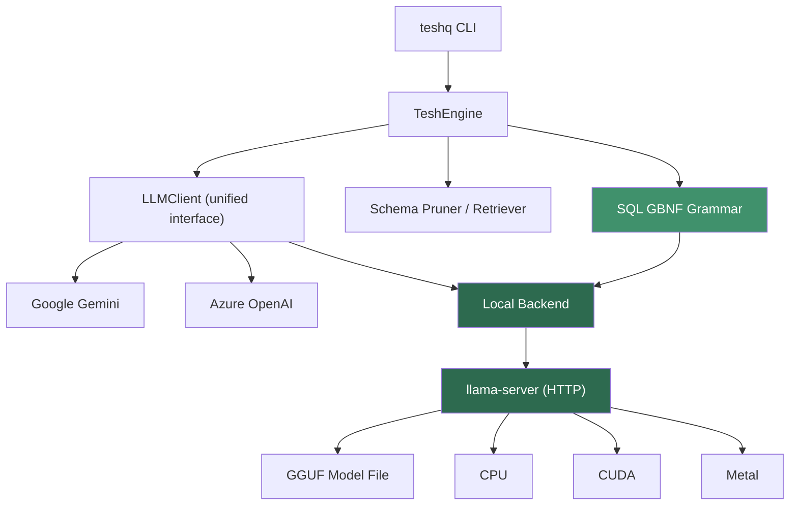

# Local LLM Backend for TESH Query — Implementation Plan

Add a local inference backend to TESH Query using a specialized text-to-SQL GGUF model served through llama.cpp, as an alternative to the current Gemini / Azure OpenAI cloud path.

## Architecture Overview



---

## User Review Required

> [!IMPORTANT]
> **Strategy Decision: llama-server vs. Native C++ Library**
> 
> Your message outlines two approaches — and explicitly recommends the **native C++ library** route over spawning `llama-server`. However, for TESH Query specifically (a Python CLI tool), I recommend a **phased approach**:
> 
> | | Phase 1 (Ship Fast) | Phase 2 (Go Native) |
> |---|---|---|
> | **Backend** | `llama-server` (OpenAI-compatible HTTP) | Native `teshq-engine` C++ binary |
> | **Integration** | Python `requests` → same `LLMClient` interface | Python ↔ C++ via `ctypes`/`pybind11` or subprocess |
> | **Effort** | ~1 week | ~4-6 weeks additional |
> | **Benefit** | Validates model quality, grammar, schema pruning immediately | Eliminates HTTP overhead, full control over memory/GPU |
> | **Risk** | HTTP latency (~5-20ms overhead per call) | Significant C++ build toolchain complexity for users |
> 
> **My recommendation**: Start with `llama-server` in Phases 1-4 to prove the concept and ship value fast. Then build `teshq-engine` as a C++ native layer in Phase 5+ once the model selection, grammar, and pipeline are validated.

> [!WARNING]
> **Model Selection**
> 
> The plan assumes a sub-4B text-to-SQL GGUF model. Candidates:
> - `defog/sqlcoder-7b-2` (GGUF quantizations available on HF)
> - `NumbersStation/NSText2SQL-Qwen-7B` (fine-tuned Qwen for text-to-SQL)
> - `PipableAI/pip-sql-1.3b` (very small, 1.3B)
> - `Qwen/Qwen2.5-Coder-3B-Instruct` (general code, not SQL-specific)
> 
> You'll need to benchmark these against your test queries in Phase 6 to pick the best one. The GBNF grammar (Phase 2) will compensate for weaker models by constraining output to valid SQL.

---

## Open Questions

> [!IMPORTANT]
> 1. **Target model size**: Do you want to cap at ~3B params (runs on 8GB RAM) or allow up to 7B (needs 16GB+ RAM)? This affects which quantizations we pull by default.
> 
> 2. **llama.cpp distribution**: Should TESH Query bundle pre-built `llama-server` binaries (like Ollama does), or require users to install llama.cpp separately? Bundling simplifies UX but adds ~50MB per platform.
> 
> 3. **Default behavior**: When a user runs `teshq query "..."` with both local and cloud configured, which should be the default? Options:
>    - Always use cloud unless `--local` flag is passed
>    - Always use local unless `--cloud` flag is passed
>    - Use local if a model is installed, cloud otherwise
> 
> 4. **Phase 5 (Native C++ Engine)**: Do you want to start planning the `teshq-engine` C++ project now, or defer until after Phases 1-4 are validated?

---

## Proposed Changes

### Phase 1 — Wire Local llama-server Backend into LLM Pipeline

The fastest path to proving the concept. Uses `llama-server`'s OpenAI-compatible `/v1/chat/completions` endpoint, so the local backend looks identical to an OpenAI provider from Python's perspective.

---

#### [NEW] [`local_server.py`](file:///e:/TESH%20Query/TESH-Query/teshq/core/local_server.py)

Manages the lifecycle of a `llama-server` process:
- `LocalServer.start(model_path, port, n_gpu_layers, n_ctx)` — spawns the process, waits for health check
- `LocalServer.stop()` — graceful shutdown
- `LocalServer.is_running()` — health probe via `/health`
- Auto-detects available GPU and sets `n_gpu_layers` accordingly
- Picks an available port if none specified
- Captures stderr for error reporting

#### [MODIFY] [`llm_factory.py`](file:///e:/TESH%20Query/TESH-Query/teshq/core/llm_factory.py)

Add a `"local"` provider branch in `build_llm()`:
```python
elif provider == "local":
    return _build_local_llm(
        model_path=model_path,
        base_url=local_server_url,
        temperature=temperature,
    )
```
Uses `langchain_openai.ChatOpenAI` pointed at `http://localhost:{port}/v1` — zero new dependencies since `langchain-openai` is already installed.

#### [MODIFY] [`settings.py`](file:///e:/TESH%20Query/TESH-Query/teshq/config/settings.py)

Add local backend settings:
```python
llm_provider: str  # now accepts "google" | "azure" | "local"
local_model_path: str = ""           # path to GGUF file
local_server_port: int = 8384        # default port for llama-server
local_n_gpu_layers: int = 0          # 0 = CPU, 99 = all on GPU
local_n_ctx: int = 4096              # context window
local_llama_server_path: str = ""    # path to llama-server binary
```

#### [MODIFY] [`loader.py`](file:///e:/TESH%20Query/TESH-Query/teshq/config/loader.py)

Extend `get_llm_config()` to return local settings when `provider == "local"`.

#### [MODIFY] [`engine.py`](file:///e:/TESH%20Query/TESH-Query/teshq/core/engine.py)

- On first `query()` call with `provider="local"`, auto-start the `LocalServer` if not already running.
- Shut down the server on process exit via `atexit`.

---

### Phase 2 — SQL GBNF Grammar for Constrained Output

Forces the local model to emit syntactically valid SQL, dramatically reducing malformed output from smaller models.

---

#### [NEW] [`sql_grammar.gbnf`](file:///e:/TESH%20Query/TESH-Query/teshq/core/sql_grammar.gbnf)

A GBNF grammar file covering:
- `SELECT` / `INSERT` / `UPDATE` / `DELETE` statements
- `FROM`, `WHERE`, `JOIN`, `GROUP BY`, `ORDER BY`, `HAVING`, `LIMIT`, `OFFSET`
- Column references, table aliases, string/number literals
- `:named_param` placeholder syntax
- Common SQL functions (`COUNT`, `SUM`, `AVG`, `MIN`, `MAX`, `COALESCE`, etc.)
- Subqueries and `UNION`/`INTERSECT`/`EXCEPT`

#### [MODIFY] [`local_server.py`](file:///e:/TESH%20Query/TESH-Query/teshq/core/local_server.py)

Pass `--grammar-file` to `llama-server` on startup, or send the grammar in the `/v1/chat/completions` request body (llama-server supports `grammar` field).

#### [MODIFY] [`sql_gen.py`](file:///e:/TESH%20Query/TESH-Query/teshq/core/sql_gen.py)

When `provider == "local"`, attach the grammar to the request. Adjust the system prompt to be more concise (smaller models need shorter, more direct instructions).

---

### Phase 3 — Smarter Schema Pruning for Small Context Windows

Small models have 4K-8K context windows. The current retriever sends up to 10 tables + FK neighbors, which can easily exceed 2K tokens. We need tighter pruning.

---

#### [MODIFY] [`retriever.py`](file:///e:/TESH%20Query/TESH-Query/teshq/core/retriever.py)

Add a `budget_tokens` parameter to `retrieve()`:
- When `provider == "local"`, default budget to ~1500 tokens (leaving room for system prompt + generation)
- Iteratively add tables by score until budget is exhausted
- Estimate token count per table using the existing `token_counter.py`

#### [MODIFY] [`engine.py`](file:///e:/TESH%20Query/TESH-Query/teshq/core/engine.py)

Pass token budget to retriever based on the active provider:
```python
budget = 1500 if self._provider == "local" else DEFAULT_TOKEN_THRESHOLD
relevant_tables = retriever.retrieve(nl_query, top_k=10, budget_tokens=budget)
```

#### [MODIFY] [`schema_graph.py`](file:///e:/TESH%20Query/TESH-Query/teshq/core/schema_graph.py)

Add `compressed_schema_within_budget(tables, max_tokens)` that drops columns (keeping PKs/FKs) if the schema is still too large after table selection.

---

### Phase 4 — Unified LLMClient Interface

Clean abstraction so the rest of the codebase never thinks about providers.

---

#### [NEW] [`llm_client.py`](file:///e:/TESH%20Query/TESH-Query/teshq/core/llm_client.py)

```python
class LLMClient(Protocol):
    """Unified interface for all LLM backends."""
    
    def generate_plan(self, nl_query: str, schema: str) -> QueryPlan: ...
    def generate_sql(self, nl_query: str, schema: str, plan: QueryPlan, 
                     error_hint: str | None = None) -> SQLQuery: ...

class CloudLLMClient(LLMClient):
    """Wraps existing Google/Azure backends."""

class LocalLLMClient(LLMClient):
    """Wraps local llama-server backend.
    
    Differences from cloud:
    - Sends GBNF grammar with SQL generation requests
    - Uses a more concise system prompt
    - Skips Stage 1 planning (local model does single-shot SQL generation)
    """
```

#### [MODIFY] [`engine.py`](file:///e:/TESH%20Query/TESH-Query/teshq/core/engine.py)

Replace direct `QueryPlanner` / `SQLGenerator` usage with `LLMClient`. For local models, the planner step is optional — small models work better with a single-shot "question → SQL" prompt.

#### [MODIFY] [`planner.py`](file:///e:/TESH%20Query/TESH-Query/teshq/core/planner.py)

Add a `LocalQueryPlanner` that uses keyword extraction instead of LLM calls (for local provider, the planning step is too expensive to waste tokens on).

---

### Phase 5 — CLI Commands: `teshq local`

User-facing commands for local model management.

---

#### [NEW] [`cli/local.py`](file:///e:/TESH%20Query/TESH-Query/teshq/cli/local.py)

```
teshq local status          # Show local backend status (model, server, GPU)
teshq local start           # Start llama-server manually
teshq local stop            # Stop llama-server
teshq local info <file>     # Show GGUF model metadata
```

#### [MODIFY] [`cli/config.py`](file:///e:/TESH%20Query/TESH-Query/teshq/cli/config.py)

Add `--local` flag to `teshq config`:
```
teshq config --local        # Configure local model path and settings
```

#### [MODIFY] [`cli/query.py`](file:///e:/TESH%20Query/TESH-Query/teshq/cli/query.py)

Add `--local` / `--cloud` flags:
```
teshq query "..." --local   # Force local inference
teshq query "..." --cloud   # Force cloud inference (default)
```

#### [MODIFY] [`cli/main.py`](file:///e:/TESH%20Query/TESH-Query/teshq/cli/main.py)

Register the `local` sub-typer.

---

### Phase 6 — Benchmark Harness (`teshq bench`)

Measures accuracy and performance of local vs. cloud.

---

#### [NEW] [`core/benchmark.py`](file:///e:/TESH%20Query/TESH-Query/teshq/core/benchmark.py)

```python
@dataclass
class BenchmarkResult:
    question: str
    expected_sql: str
    generated_sql: str
    execution_match: bool    # do both queries return same rows?
    exact_match: bool        # normalized SQL strings match?
    latency_ms: int
    tokens_used: int
    provider: str
```

Includes a curated test set of 50-100 NL→SQL pairs against your FMCG database.

#### [NEW] [`cli/bench.py`](file:///e:/TESH%20Query/TESH-Query/teshq/cli/bench.py)

```
teshq bench                     # Run all benchmarks against current provider
teshq bench --local --cloud     # Compare both
teshq bench --export results.md # Export results as markdown table
```

#### [NEW] [`benchmarks/`](file:///e:/TESH%20Query/TESH-Query/benchmarks/)

Directory containing:
- `questions.yaml` — NL questions + reference SQL
- `results/` — stored benchmark run outputs

---

### Phase 7 — Model Management (`teshq pull` / `teshq list` / `teshq remove`)

Download and manage GGUF models from Hugging Face.

---

#### [NEW] [`core/model_manager.py`](file:///e:/TESH%20Query/TESH-Query/teshq/core/model_manager.py)

```python
class ModelManager:
    """Manages GGUF models in ~/.teshq/models/"""
    
    MODELS_DIR = Path.home() / ".teshq" / "models"
    REGISTRY = {
        "sqlcoder:7b-q4": "defog/sqlcoder-7b-2/sqlcoder-7b-q4_K_M.gguf",
        "pip-sql:1.3b-q8": "PipableAI/pip-sql-1.3b/...",
    }
    
    def pull(self, name: str, quant: str = "auto") -> Path: ...
    def list(self) -> List[ModelInfo]: ...
    def remove(self, name: str) -> bool: ...
    def info(self, path_or_name: str) -> ModelMetadata: ...
    def auto_select_quant(self, name: str) -> str: ...
```

#### [NEW] [`cli/model.py`](file:///e:/TESH%20Query/TESH-Query/teshq/cli/model.py)

```
teshq pull sqlcoder:7b          # Download model
teshq list                      # List installed models
teshq remove sqlcoder:7b        # Remove model
```

#### [MODIFY] [`core/model_manager.py`](file:///e:/TESH%20Query/TESH-Query/teshq/core/model_manager.py)

`auto_select_quant()` detects:
- Total system RAM
- CPU core count
- GPU presence and VRAM (via `nvidia-smi`, `rocm-smi`, or system_profiler on macOS)
- Recommends Q4_K_M for <16GB RAM, Q5_K_M for 16-32GB, Q8_0 for 32GB+

---

### Phase 8 — Native C++ Engine (Future — `teshq-engine`)

> [!NOTE]
> This phase is deferred until Phases 1-7 are validated. Listed here for architectural planning.

```
teshq-engine/
├── CMakeLists.txt
├── src/
│   ├── main.cpp          # CLI entry point for standalone testing
│   ├── engine.cpp         # TeshqEngine class
│   ├── engine.h
│   └── python_binding.cpp # pybind11 wrapper
└── third_party/
    └── llama.cpp/         # git submodule
```

The C++ engine would expose a Python extension module:
```python
import teshq_engine
engine = teshq_engine.TeshqEngine()
engine.load("model.gguf", n_gpu_layers=99)
result = engine.generate("SELECT ...", max_tokens=512)
```

This eliminates the HTTP overhead and gives full control over memory, threading, and batch inference.

---

## Phased Execution Summary

| Phase | What | New Files | Modified Files | Effort |
|-------|------|-----------|----------------|--------|
| 1 | Local llama-server backend | `local_server.py` | `llm_factory.py`, `settings.py`, `loader.py`, `engine.py` | 3-4 days |
| 2 | SQL GBNF grammar | `sql_grammar.gbnf` | `local_server.py`, `sql_gen.py` | 2-3 days |
| 3 | Smarter schema pruning | — | `retriever.py`, `engine.py`, `schema_graph.py` | 1-2 days |
| 4 | Unified LLMClient | `llm_client.py` | `engine.py`, `planner.py` | 2-3 days |
| 5 | CLI commands (`teshq local`) | `cli/local.py` | `cli/config.py`, `cli/query.py`, `cli/main.py` | 2 days |
| 6 | Benchmark harness | `core/benchmark.py`, `cli/bench.py`, `benchmarks/` | — | 3-4 days |
| 7 | Model management | `core/model_manager.py`, `cli/model.py` | — | 3-4 days |
| 8 | Native C++ engine | `teshq-engine/` (separate project) | Python bindings | 4-6 weeks |

**Total for Phases 1-7: ~3-4 weeks**
**Phase 8: separate project, 4-6 weeks additional**

---

## Verification Plan

### Automated Tests

```bash
# Unit tests for each new module
pytest tests/unit/test_local_server.py -v
pytest tests/unit/test_llm_client.py -v
pytest tests/unit/test_sql_grammar.py -v
pytest tests/unit/test_model_manager.py -v
pytest tests/unit/test_benchmark.py -v

# Integration test: local backend end-to-end
pytest tests/integration/test_local_e2e.py -v

# Benchmark comparison
teshq bench --local --cloud --export benchmarks/results/run_001.md
```

### Manual Verification

1. **Phase 1 smoke test**: `teshq query "show top 10 customers by revenue" --local` produces correct SQL
2. **Phase 2 grammar test**: Run 50 queries through local backend, verify 0 syntax errors in generated SQL
3. **Phase 3 context test**: Verify schema prompt for local backend stays under 2000 tokens for a 100+ table database
4. **Phase 6 benchmark**: Compare accuracy (execution match %) and latency between local and Gemini Flash Lite
5. **Phase 7 model test**: `teshq pull sqlcoder:7b` downloads correctly, `teshq list` shows it, `teshq query --local` uses it
