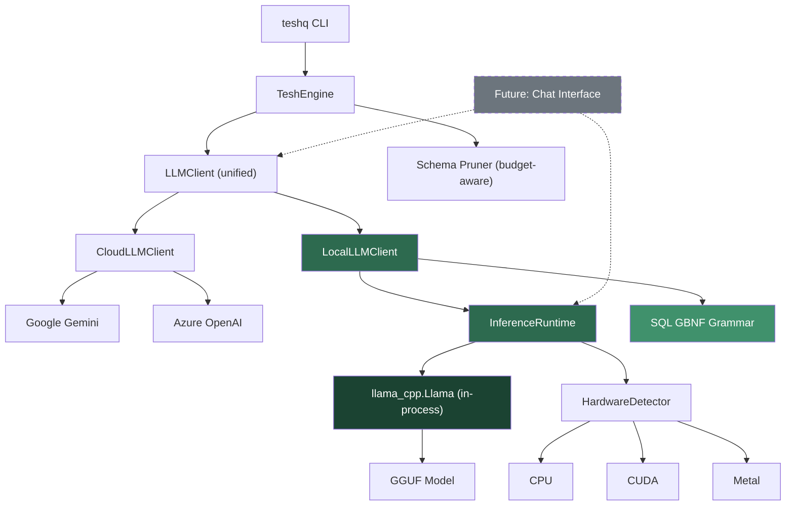
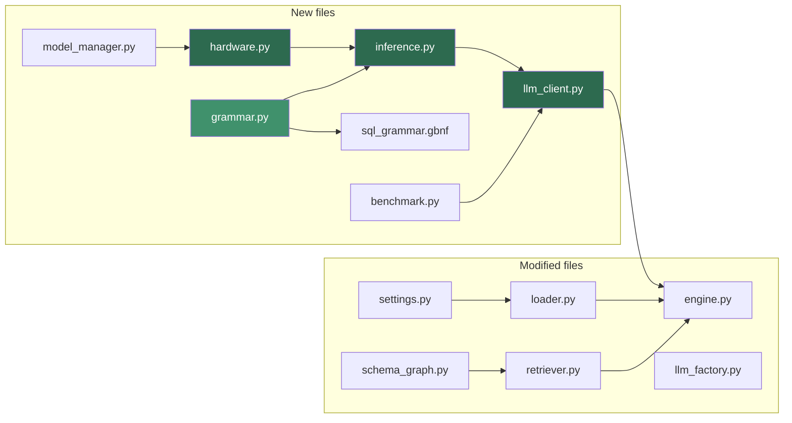

# Local LLM Backend for TESH Query — Implementation Plan (v2)

Add a **direct, in-process** local inference backend to TESH Query using `llama-cpp-python` (Python bindings for llama.cpp). No HTTP server, no Docker, no separate process — the GGUF model loads directly into the TESH Query Python process.

## Architecture Overview



### Why In-Process, Not llama-server

| | In-process (`llama-cpp-python`) | Separate server (`llama-server`) |
|---|---|---|
| **Latency** | Zero HTTP overhead, direct C function calls | 5-20ms per request (localhost HTTP) |
| **Complexity** | Single process, `pip install` | Spawn/manage child process, health checks, port conflicts |
| **Memory** | Shared address space, no duplication | Separate process memory |
| **User DX** | `pip install teshq[local]` → works | Must install llama.cpp separately or bundle binaries |
| **Control** | Full access to tokenizer, KV cache, sampling | Black box behind HTTP |
| **Future chat** | Same `Llama` instance serves SQL + chat | Would need separate server or shared state |

---

## Open Questions

> [!IMPORTANT]
> 1. **Default behavior** when both local and cloud are configured — options:
>    - (a) Use local if a model is installed, cloud as fallback
>    - (b) Always cloud unless `--local` is passed
>    - (c) Configurable default in `config.yaml`
>
> 2. **Model size cap** — 3B (runs on 8GB RAM) vs 7B (needs 16GB+)? Affects default `teshq pull` behavior.
>
> 3. **Phase 8 chat interface** — Do you envision this as:
>    - (a) A CLI-based interactive REPL (`teshq chat`)
>    - (b) A web-based chat UI served locally
>    - (c) Both

---

## Proposed Changes

### Phase 1 — In-Process Inference Runtime

The core: load a GGUF model directly into the Python process via `llama-cpp-python`, with automatic hardware detection.

---

#### [NEW] [`teshq/core/inference.py`](file:///e:/TESH%20Query/TESH-Query/teshq/core/inference.py)

The lightweight inference runtime — the heart of local mode.

```python
"""
In-process LLM inference runtime for TESH Query.

Uses llama-cpp-python to load GGUF models directly into the Python process.
No HTTP server, no subprocess — just direct C library calls via ctypes.
"""

from dataclasses import dataclass
from pathlib import Path
from typing import Optional, Iterator

@dataclass
class InferenceConfig:
    """Configuration for the local inference runtime."""
    model_path: str
    n_ctx: int = 4096           # context window
    n_gpu_layers: int = -1      # -1 = auto (all layers to GPU if available)
    n_threads: int = 0          # 0 = auto-detect CPU cores
    seed: int = 42              # deterministic output
    verbose: bool = False

@dataclass
class GenerationResult:
    """Result from a single inference call."""
    text: str
    tokens_used: int
    prompt_tokens: int
    completion_tokens: int
    latency_ms: float

class InferenceRuntime:
    """
    Manages a single llama.cpp model instance in-process.
    
    Lifecycle:
        runtime = InferenceRuntime()
        runtime.load(config)
        result = runtime.generate(prompt, max_tokens=512)
        # ... reuse for many queries ...
        runtime.unload()
    
    The same instance can serve both SQL generation and future chat.
    """
    
    def __init__(self):
        self._llm = None           # llama_cpp.Llama instance
        self._config = None
        self._loaded = False
    
    def load(self, config: InferenceConfig) -> None:
        """Load a GGUF model into memory."""
        from llama_cpp import Llama
        
        n_gpu = config.n_gpu_layers
        if n_gpu == -1:
            n_gpu = self._detect_gpu_layers()
        
        self._llm = Llama(
            model_path=config.model_path,
            n_ctx=config.n_ctx,
            n_gpu_layers=n_gpu,
            n_threads=config.n_threads or self._detect_threads(),
            seed=config.seed,
            verbose=config.verbose,
        )
        self._config = config
        self._loaded = True
    
    def generate(
        self,
        prompt: str,
        system_prompt: str = "",
        max_tokens: int = 512,
        temperature: float = 0.0,
        grammar = None,          # LlamaGrammar instance
        stop: list[str] = None,
    ) -> GenerationResult:
        """Run inference and return the complete result."""
        ...
    
    def generate_stream(
        self,
        prompt: str,
        system_prompt: str = "",
        max_tokens: int = 512,
        temperature: float = 0.0,
        grammar = None,
        stop: list[str] = None,
    ) -> Iterator[str]:
        """Stream tokens as they are generated (for future chat UI)."""
        ...
    
    def unload(self) -> None:
        """Free the model from memory."""
        ...
    
    @property
    def is_loaded(self) -> bool: ...
    
    @property
    def model_info(self) -> dict: ...
    
    # --- Hardware detection ---
    
    @staticmethod
    def _detect_gpu_layers() -> int:
        """Auto-detect GPU and return appropriate n_gpu_layers."""
        # Try CUDA (nvidia-smi), then Metal (macOS), then CPU
        ...
    
    @staticmethod
    def _detect_threads() -> int:
        """Return optimal thread count (physical cores, not logical)."""
        ...
```

Key design decisions:
- **Singleton-ish**: One `InferenceRuntime` per `TeshEngine` instance. The model stays loaded across multiple queries (amortizes ~2-5s load time).
- **`generate_stream()`**: Returns an `Iterator[str]` — ready for the future chat interface without any refactoring.
- **`grammar` parameter**: Accepts a `LlamaGrammar` for SQL-constrained generation (Phase 2).
- **`-1` auto GPU**: Tries to offload all layers; falls back gracefully if no GPU.

#### [NEW] [`teshq/core/hardware.py`](file:///e:/TESH%20Query/TESH-Query/teshq/core/hardware.py)

Hardware detection and recommendation engine.

```python
@dataclass
class HardwareProfile:
    cpu_cores: int             # physical cores
    ram_total_gb: float
    ram_available_gb: float
    gpu_name: str | None       # e.g. "NVIDIA RTX 4060"
    gpu_vram_mb: int           # 0 if no GPU
    gpu_backend: str           # "cuda" | "metal" | "vulkan" | "cpu"
    recommended_quant: str     # "Q4_K_M", "Q5_K_M", "Q8_0"
    recommended_n_gpu_layers: int
    recommended_n_ctx: int

def detect_hardware() -> HardwareProfile:
    """Detect system hardware and recommend model settings."""
    # CPU: os.cpu_count(), psutil if available
    # RAM: psutil or platform-specific
    # GPU: nvidia-smi (CUDA), system_profiler (Metal), or vulkaninfo
    ...

def recommend_quant(ram_gb: float, vram_mb: int) -> str:
    """Recommend quantization level based on available memory."""
    if vram_mb >= 8000 or ram_gb >= 32:
        return "Q8_0"
    elif vram_mb >= 4000 or ram_gb >= 16:
        return "Q5_K_M"
    else:
        return "Q4_K_M"
```

#### [MODIFY] [`pyproject.toml`](file:///e:/TESH%20Query/TESH-Query/pyproject.toml)

Add a `local` optional dependency group:

```toml
[project.optional-dependencies]
local = [
    "llama-cpp-python>=0.3.0",
]
```

Users install local mode with: `pip install teshq[local]`

The core `teshq` package has zero new dependencies — `llama-cpp-python` is only imported when `provider == "local"`.

#### [MODIFY] [`settings.py`](file:///e:/TESH%20Query/TESH-Query/teshq/config/settings.py)

Add local backend settings:

```python
# --- Local LLM settings ---
local_model_path: str = Field(default="", alias="LOCAL_MODEL_PATH")
local_n_gpu_layers: int = Field(default=-1, alias="LOCAL_N_GPU_LAYERS")  # -1 = auto
local_n_ctx: int = Field(default=4096, alias="LOCAL_N_CTX")
local_n_threads: int = Field(default=0, alias="LOCAL_N_THREADS")  # 0 = auto
```

Also update `SETTINGS_KEYS` and `effective_provider` to support `"local"`.

#### [MODIFY] [`loader.py`](file:///e:/TESH%20Query/TESH-Query/teshq/config/loader.py)

Extend `get_llm_config()` to return local settings when `provider == "local"`:

```python
elif provider == "local":
    return {
        "provider": "local",
        "model_path": s.local_model_path,
        "n_gpu_layers": s.local_n_gpu_layers,
        "n_ctx": s.local_n_ctx,
        "n_threads": s.local_n_threads,
    }
```

#### [MODIFY] [`engine.py`](file:///e:/TESH%20Query/TESH-Query/teshq/core/engine.py)

- Lazily initialize `InferenceRuntime` on first local query
- Keep model loaded across queries (amortize load time)
- Register `atexit` handler to unload model on process exit
- Pass grammar + pruned schema to local generation path

---

### Phase 2 — SQL GBNF Grammar for Constrained Output

Forces the local model to emit **only** syntactically valid SQL, dramatically reducing malformed output from smaller models. This is the critical quality lever — it compensates for using a 3-4B model instead of Gemini.

---

#### [NEW] [`teshq/core/sql_grammar.gbnf`](file:///e:/TESH%20Query/TESH-Query/teshq/core/sql_grammar.gbnf)

A GBNF grammar covering:
- `SELECT` statements with `FROM`, `WHERE`, `JOIN`, `GROUP BY`, `ORDER BY`, `HAVING`, `LIMIT`, `OFFSET`
- Column references, table aliases, `*`
- String, number, date literals and `:named_param` placeholders
- Common SQL functions (`COUNT`, `SUM`, `AVG`, `MIN`, `MAX`, `COALESCE`, `CASE/WHEN`)
- Comparison operators, `AND`/`OR`/`NOT`, `LIKE`, `IN`, `BETWEEN`, `IS NULL`
- Subqueries in `WHERE` and `FROM`
- `UNION`/`INTERSECT`/`EXCEPT`
- **Excludes**: `DROP`, `TRUNCATE`, `ALTER`, `CREATE` (safety)

```gbnf
# Simplified excerpt — full grammar will be ~100 lines
root        ::= select-stmt
select-stmt ::= "SELECT" ws columns ws "FROM" ws table-refs
                (ws where-clause)?
                (ws group-clause)?
                (ws having-clause)?
                (ws order-clause)?
                (ws limit-clause)?
# ...
```

#### [NEW] [`teshq/core/grammar.py`](file:///e:/TESH%20Query/TESH-Query/teshq/core/grammar.py)

Loader for the GBNF grammar file:

```python
from llama_cpp import LlamaGrammar
from pathlib import Path

_GRAMMAR_PATH = Path(__file__).parent / "sql_grammar.gbnf"
_cached_grammar = None

def get_sql_grammar() -> LlamaGrammar:
    """Load and cache the SQL GBNF grammar."""
    global _cached_grammar
    if _cached_grammar is None:
        _cached_grammar = LlamaGrammar.from_file(str(_GRAMMAR_PATH))
    return _cached_grammar
```

#### [MODIFY] [`inference.py`](file:///e:/TESH%20Query/TESH-Query/teshq/core/inference.py)

`generate()` accepts the `grammar` parameter and passes it to `llm.create_chat_completion(grammar=grammar)`.

---

### Phase 3 — Budget-Aware Schema Pruning

Small models have 4K context. Current retriever can send 2K+ tokens of schema. We need to fit: system prompt (~300 tokens) + schema (~1500 tokens) + user query (~100 tokens) + generation budget (~500 tokens) = 2400 tokens, well within 4K.

---

#### [MODIFY] [`retriever.py`](file:///e:/TESH%20Query/TESH-Query/teshq/core/retriever.py)

Add `budget_tokens` parameter to `retrieve()`:

```python
def retrieve(
    self,
    nl_query: str,
    top_k: int = 10,
    expand_neighbors: bool = True,
    budget_tokens: int | None = None,  # NEW: token budget cap
) -> List[str]:
    """
    When budget_tokens is set:
    1. Rank tables by TF-IDF score (existing logic)
    2. Iteratively add tables until budget is exhausted
    3. Estimate tokens per table via len(compressed_repr) / 4
    """
```

#### [MODIFY] [`schema_graph.py`](file:///e:/TESH%20Query/TESH-Query/teshq/core/schema_graph.py)

Add `compressed_schema_within_budget(tables, max_tokens)`:
- Start with all selected tables
- If over budget, drop columns (keeping PKs and FKs)
- If still over, drop least-relevant tables

#### [MODIFY] [`engine.py`](file:///e:/TESH%20Query/TESH-Query/teshq/core/engine.py)

Set token budget based on provider:
```python
budget = 1500 if self._provider == "local" else None  # None = no limit (cloud)
relevant_tables = retriever.retrieve(nl_query, top_k=10, budget_tokens=budget)
```

---

### Phase 4 — Unified LLMClient Abstraction

Clean interface so the engine never thinks about providers. Also sets up the architecture for the future chat interface.

---

#### [NEW] [`teshq/core/llm_client.py`](file:///e:/TESH%20Query/TESH-Query/teshq/core/llm_client.py)

```python
from typing import Protocol, Iterator

class LLMClient(Protocol):
    """Unified interface for all LLM backends."""
    
    def generate_plan(self, nl_query: str, schema: str) -> QueryPlan: ...
    def generate_sql(
        self, nl_query: str, schema: str, plan: QueryPlan,
        error_hint: str | None = None,
    ) -> SQLQuery: ...
    
    # --- Future chat interface ---
    def chat(self, message: str, history: list[dict]) -> str: ...
    def chat_stream(self, message: str, history: list[dict]) -> Iterator[str]: ...


class CloudLLMClient:
    """Wraps existing Google/Azure via LangChain (unchanged behavior)."""
    
    def __init__(self, planner: QueryPlanner, sql_gen: SQLGenerator):
        self._planner = planner
        self._sql_gen = sql_gen
    
    def generate_plan(self, nl_query, schema):
        return self._planner.plan(nl_query, schema)
    
    def generate_sql(self, nl_query, schema, plan, error_hint=None):
        return self._sql_gen.generate(nl_query, schema, plan, error_hint=error_hint)


class LocalLLMClient:
    """Direct in-process inference via llama-cpp-python.
    
    Key differences from cloud:
    - Single-shot generation (skip planning stage — too expensive for small models)
    - SQL GBNF grammar for constrained output
    - Concise system prompt optimized for small context windows
    - Direct tokenization and inference, no LangChain overhead
    """
    
    def __init__(self, runtime: InferenceRuntime):
        self._runtime = runtime
        self._grammar = get_sql_grammar()
    
    def generate_plan(self, nl_query, schema) -> QueryPlan:
        """For local: use keyword extraction (no LLM call)."""
        # Fast, deterministic, zero-cost plan via schema_pruner logic
        ...
    
    def generate_sql(self, nl_query, schema, plan, error_hint=None) -> SQLQuery:
        """Single-shot SQL generation with grammar constraint."""
        prompt = self._build_sql_prompt(nl_query, schema, error_hint)
        result = self._runtime.generate(
            prompt=prompt,
            system_prompt=_LOCAL_SQL_SYSTEM_PROMPT,
            max_tokens=512,
            temperature=0.0,
            grammar=self._grammar,
        )
        return SQLQuery(query=result.text.strip(), parameters={})
    
    def chat(self, message, history) -> str:
        """Future: general chat via the same loaded model."""
        ...
    
    def chat_stream(self, message, history) -> Iterator[str]:
        """Future: streaming chat."""
        ...
```

The `_LOCAL_SQL_SYSTEM_PROMPT` will be much shorter than the cloud prompt — optimized for small context:

```python
_LOCAL_SQL_SYSTEM_PROMPT = """Generate a single SQL SELECT statement.
Rules: Use explicit column names. Use table aliases for joins.
Follow FK annotations for JOIN columns. Output only SQL, nothing else."""
```

#### [MODIFY] [`engine.py`](file:///e:/TESH%20Query/TESH-Query/teshq/core/engine.py)

Replace direct `QueryPlanner` / `SQLGenerator` usage with `LLMClient`:

```python
def _get_llm_client(self) -> LLMClient:
    if self._provider == "local":
        return LocalLLMClient(self._get_runtime())
    else:
        return CloudLLMClient(self._get_planner(), self._get_sql_gen())
```

For `provider == "local"`, the planning stage uses keyword extraction (free), and SQL generation is a single `llm.create_chat_completion()` call with the GBNF grammar.

#### [MODIFY] [`llm_factory.py`](file:///e:/TESH%20Query/TESH-Query/teshq/core/llm_factory.py)

The `build_llm()` function no longer needs a `"local"` branch — local inference bypasses LangChain entirely. But we keep the factory for cloud providers and add a note.

---

### Phase 5 — CLI Commands: `teshq local`

---

#### [NEW] [`teshq/cli/local.py`](file:///e:/TESH%20Query/TESH-Query/teshq/cli/local.py)

```
teshq local status         # Show: model loaded? GPU detected? RAM usage? 
teshq local info <file>    # Show GGUF model metadata (size, quant, context)
teshq local test           # Run a smoke test query against the loaded model
```

#### [MODIFY] [`cli/config.py`](file:///e:/TESH%20Query/TESH-Query/teshq/cli/config.py)

Add `--local` flag:
```
teshq config --local       # Interactive setup: model path, GPU layers, context size
```

#### [MODIFY] [`cli/query.py`](file:///e:/TESH%20Query/TESH-Query/teshq/cli/query.py)

Add `--local` / `--cloud` flags:
```
teshq query "..." --local   # Force local inference for this query
teshq query "..." --cloud   # Force cloud inference for this query
```

#### [MODIFY] [`cli/main.py`](file:///e:/TESH%20Query/TESH-Query/teshq/cli/main.py)

Register the `local` sub-typer.

---

### Phase 6 — Benchmark Harness (`teshq bench`)

---

#### [NEW] [`teshq/core/benchmark.py`](file:///e:/TESH%20Query/TESH-Query/teshq/core/benchmark.py)

```python
@dataclass
class BenchmarkResult:
    question: str
    expected_sql: str
    generated_sql: str
    execution_match: bool     # both queries return same rows?
    exact_match: bool         # normalized SQL strings match?
    latency_ms: int
    tokens_used: int
    provider: str             # "local" | "google" | "azure"
    model: str                # model name or GGUF filename
    memory_mb: float          # peak memory during generation
```

Curated test set of 50-100 NL→SQL pairs against the FMCG database.

#### [NEW] [`teshq/cli/bench.py`](file:///e:/TESH%20Query/TESH-Query/teshq/cli/bench.py)

```
teshq bench                      # Run against current provider
teshq bench --local --cloud      # Compare both side-by-side
teshq bench --export results.md  # Export as markdown table
```

#### [NEW] [`benchmarks/`](file:///e:/TESH%20Query/TESH-Query/benchmarks/)

```
benchmarks/
├── questions.yaml         # NL questions + reference SQL
├── results/               # Stored benchmark outputs
└── README.md              # How to run and interpret benchmarks
```

---

### Phase 7 — Model Management (`teshq pull` / `teshq list` / `teshq remove`)

---

#### [NEW] [`teshq/core/model_manager.py`](file:///e:/TESH%20Query/TESH-Query/teshq/core/model_manager.py)

```python
class ModelManager:
    """Manages GGUF models in ~/.teshq/models/"""
    
    MODELS_DIR = Path.home() / ".teshq" / "models"
    
    # Curated registry of known text-to-SQL models
    REGISTRY = {
        "qwen3-sql:4b-q4":  {"repo": "...", "file": "...", "size_gb": 2.4},
        "sqlcoder:7b-q4":   {"repo": "defog/sqlcoder-7b-2", "file": "...", "size_gb": 4.1},
        "pip-sql:1.3b-q8":  {"repo": "PipableAI/pip-sql-1.3b", "file": "...", "size_gb": 1.4},
    }
    
    def pull(self, name: str) -> Path:
        """Download a model from Hugging Face."""
        # Uses requests + progress bar, stores in MODELS_DIR
        ...
    
    def list(self) -> list[ModelInfo]:
        """List installed models with size and metadata."""
        ...
    
    def remove(self, name: str) -> bool:
        """Delete a model file."""
        ...
    
    def info(self, path_or_name: str) -> ModelMetadata:
        """Read GGUF metadata (quant level, context size, parameter count)."""
        ...
    
    def auto_select(self) -> str:
        """Pick the best installed model based on hardware profile."""
        hw = detect_hardware()
        # Match model size to available RAM/VRAM
        ...
```

#### [NEW] [`teshq/cli/model.py`](file:///e:/TESH%20Query/TESH-Query/teshq/cli/model.py)

```
teshq pull qwen3-sql:4b     # Download model (with progress bar)
teshq list                   # List installed models
teshq remove qwen3-sql:4b   # Delete model
teshq info model.gguf       # Show GGUF file metadata
```

---

### Phase 8 — Chat Interface (Future)

> [!NOTE]
> This phase builds on the infrastructure from Phases 1-4. The `InferenceRuntime.generate_stream()` and `LLMClient.chat_stream()` APIs are already in place.

#### 8a — CLI Chat REPL

#### [NEW] [`teshq/cli/chat.py`](file:///e:/TESH%20Query/TESH-Query/teshq/cli/chat.py)

```
teshq chat                   # Interactive SQL chat with conversation memory
teshq chat --model qwen3:4b  # Chat with a specific model
```

Features:
- Streaming token output in terminal (using `rich.live`)
- Conversation history (multi-turn context)
- Auto-executes SQL against connected database
- Shows results inline

#### 8b — Local Web Chat UI

#### [NEW] [`teshq/web/`](file:///e:/TESH%20Query/TESH-Query/teshq/web/)

```
teshq serve                  # Start local web UI on http://localhost:8385
```

A lightweight single-page app:
- Uses `FastAPI` or Python's built-in `http.server` + WebSocket
- Chat-style interface with streaming responses
- SQL syntax highlighting
- Query result tables
- Database schema browser sidebar

Both chat modes reuse the same `InferenceRuntime` instance — the model loads once and serves both SQL generation and conversational queries.

---

## Execution Summary

```mermaid
gantt
    title TESH Query Local Backend — Execution Timeline
    dateFormat  X
    axisFormat  Day %s
    
    section Phase 1: Runtime
    InferenceRuntime + hardware detect   :p1a, 0, 2d
    Settings/loader/engine integration   :p1b, after p1a, 2d
    
    section Phase 2: Grammar
    Write SQL GBNF grammar               :p2a, after p1b, 2d
    Grammar loader + integration         :p2b, after p2a, 1d
    
    section Phase 3: Pruning
    Budget-aware retriever               :p3, after p2b, 2d
    
    section Phase 4: LLMClient
    Unified client abstraction           :p4a, after p3, 2d
    Engine refactor                      :p4b, after p4a, 1d
    
    section Phase 5: CLI
    local/config/query CLI commands      :p5, after p4b, 2d
    
    section Phase 6: Bench
    Benchmark harness + test set         :p6, after p5, 3d
    
    section Phase 7: Models
    Model manager + pull/list/remove     :p7, after p5, 3d
    
    section Phase 8: Chat
    CLI chat REPL                        :p8a, after p7, 3d
    Web chat UI                          :p8b, after p8a, 5d
```



| Phase | What | New Files | Modified Files | Effort |
|-------|------|-----------|----------------|--------|
| **1** | In-process inference runtime | `inference.py`, `hardware.py` | `pyproject.toml`, `settings.py`, `loader.py`, `engine.py` | 3-4 days |
| **2** | SQL GBNF grammar | `sql_grammar.gbnf`, `grammar.py` | `inference.py` | 2-3 days |
| **3** | Budget-aware schema pruning | — | `retriever.py`, `schema_graph.py`, `engine.py` | 2 days |
| **4** | Unified LLMClient | `llm_client.py` | `engine.py`, `llm_factory.py` | 2-3 days |
| **5** | CLI commands | `cli/local.py` | `cli/config.py`, `cli/query.py`, `cli/main.py` | 2 days |
| **6** | Benchmark harness | `core/benchmark.py`, `cli/bench.py`, `benchmarks/` | — | 3 days |
| **7** | Model management | `core/model_manager.py`, `cli/model.py` | — | 3 days |
| **8** | Chat interface | `cli/chat.py`, `web/` | — | 5-8 days |

**Phases 1-5 (shippable local mode): ~12-14 days**
**Phases 6-7 (benchmarks + model DX): ~6 days**  
**Phase 8 (chat): ~5-8 days**

---

## File Dependency Graph



---

## Verification Plan

### Automated Tests

```bash
# Unit tests
pytest tests/unit/test_inference.py -v      # Runtime load/generate/unload
pytest tests/unit/test_hardware.py -v       # Hardware detection mocking
pytest tests/unit/test_grammar.py -v        # Grammar loads, constrains output
pytest tests/unit/test_llm_client.py -v     # Client interface contracts
pytest tests/unit/test_model_manager.py -v  # Pull/list/remove

# Integration test (requires a GGUF model)
pytest tests/integration/test_local_e2e.py -v

# Benchmark
teshq bench --local --cloud --export benchmarks/results/baseline.md
```

### Manual Verification

1. **Phase 1 smoke test**: `teshq query "show top 10 customers" --local` returns correct SQL using in-process model
2. **Memory check**: Model loads once, stays resident across 10 consecutive queries, RAM stays stable
3. **Phase 2 grammar**: 50 queries through local → 0 syntax errors in generated SQL
4. **Phase 3 context**: Schema prompt stays under 1500 tokens for the FMCG 100+ table database
5. **Phase 6 benchmark**: Execution-match accuracy ≥ 70% for local vs ≥ 90% for Gemini Flash Lite
6. **Phase 7 model DX**: `teshq pull qwen3-sql:4b` → `teshq list` → `teshq query --local` end-to-end flow
7. **Phase 8 chat**: `teshq chat` maintains multi-turn context, auto-executes generated SQL
